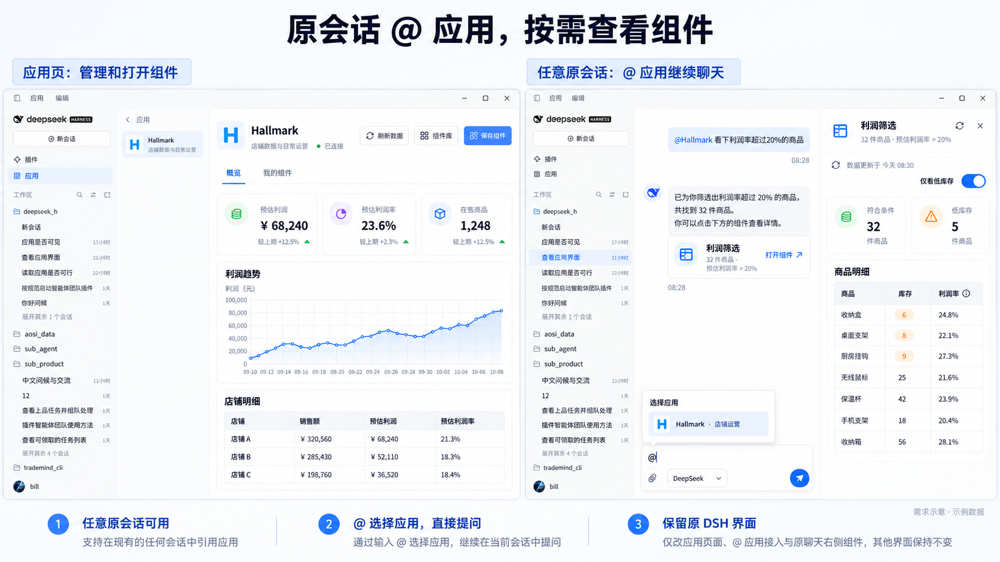
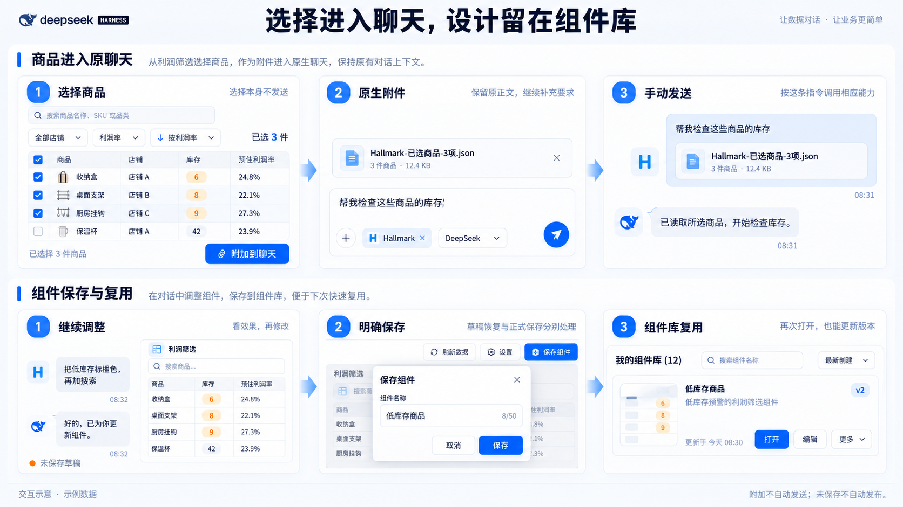

# DSH Apps 桌面应用需求整理

整理日期：2026-10-07。本文汇总用户原需求、后续交互要求、当前多应用架构要求，以及用户明确指定的两张视觉参考。内容是需要达到的产品行为与后续验收目标，不表示新界面已经实现或部署。

**产品目标：在原 DSH 桌面版中，把已有业务应用接进同一个 Agent 和原有聊天，让用户用自然语言办业务、制作好看的交互组件，并把满意的组件保存起来日常使用。**

工作在原 `dsh-hallmark-app` 插件项目上覆盖更新，最终更新桌面已安装的原插件。第一版供用户本人本机使用，首个真实业务应用为 Hallmark；共享 Apps 外壳支持后续接入其他应用。

**最新纠正优先：用户明确要求在任意原有 DSH 会话的输入框中，通过 `@` 选择应用，直接继续聊天。改造范围限于应用页、组件展示区和必要的原输入区接入；保持现有 DSH 窗口、左导航、项目/会话列表和聊天界面，不新增独立聊天标签，不制作跨整个 DSH 的统一标签栏。**

## 1. 原有产品范围要保留

| 编号 | 需求 | 用户能感受到的行为 |
|---|---|---|
| PR-01 | 原 DSH 桌面集成 | 任意原会话都可通过原输入框的 `@` 选择应用；“应用”页用于工作台与组件管理，保留现有窗口、左导航、项目/会话列表、消息、输入框、模型选择、附件和发送能力。 |
| PR-02 | 一个 Apps 入口接入多个应用 | 应用目录展示真实接入的应用，可搜索、选择并查看工作台；应用和连接分别识别，店铺是业务参数。 |
| PR-03 | 任意原会话引用并连续使用应用 | 用户在原输入框输入 `@`，从候选中选择 Hallmark 等已接入应用，再按原发送流程提交请求；该会话应用能力持续可用直到明确关闭或切换。进入应用工作台不是聊天前置步骤，界面焦点变化不暗中删除其他已启用应用绑定。 |
| PR-04 | 保留完整核心业务目标 | 店铺和商品查询、利润查询与筛选、已有采集商品上品、调价、库存修改均在原产品范围内；其他核心能力沿用实际接口覆盖清单。 |
| PR-05 | 源数据与加工能力分别可用 | Agent 可读取平台源字段及手动扩展采集的原始资料，再按需调用已有成本、利润计算和筛选。用户继续使用原扩展手动采集。 |
| PR-06 | 自然语言直接发起业务 | 用户说目标店铺、商品和动作，内部必要上下文由接入流程或 Agent 准备；无需人工派发、领取或先操作旧看板，也不新增逐次人工审批流程。目标或必需参数真正缺失时在原聊天澄清。 |
| PR-07 | 执行与展示可以分开 | 可以只办业务，也可以只展示已有数据，或执行后展示。回复长短与展示方式由当前指令及聊天约定决定。 |

第一版完整业务目标与本次桌面读取测试的范围分别记录。使用 Bill 店铺做桌面验收，不代表所有真实上品、价格和库存写入已验收；需要验证具体写链时，再落实相应商品和业务参数。

`@` 选择绑定到输入框所属的真实会话，保留已输入正文和已有附件，不自动发送或执行业务写操作。应用、连接和店铺分别识别；有多个候选且当前任务无法唯一确定目标时再澄清，不给每次引用新增必经连接向导。候选、引用状态、实际会话绑定与 Agent 可用能力必须一致，取消或失败不得假装成功。

## 2. 保留现有 DSH，只改必要插件区域

用户最新提供的实际桌面截图是宿主界面的基准。早期两张设计参考用于应用与组件内容的视觉品质；其中新增全局标签和独立聊天标签的部分已被最新要求撤回。

### PR-08 · 工作台态

页面顺序为 **原 DSH 左导航 → 应用列表 → 所选应用工作区**。

应用列表有搜索、图标、名称、说明、选中态和管理入口。所选应用内容区有图标、名称、说明、真实连接状态、刷新与组件库入口。数据页面依次呈现标题、筛选器、关键指标、图表和明细。概览、组件库或已打开组件的局部导航限于应用内容区，不创建聊天标签，也不成为引用应用的必经步骤。

### PR-09 · 聊天与并排组件态

在任意已有会话中输入 `@` 选择应用，继续使用原聊天。需要组件时，页面顺序为 **原 DSH 左导航 → 原会话聊天 → 原右侧组件区**。没有组件时保持原聊天布局。

保留原消息和原输入框，仅通过宿主支持的扩展点加入应用候选与必要引用状态；选择应用不跳转、不另建会话、不新增独立聊天页。生成组件后，聊天中有名称、摘要和“打开组件”入口。右侧组件有标题、条件摘要、数据时间、刷新、筛选、交互内容、展开及关闭动作。需要更多空间时，可在应用工作区打开宽组件内容；原聊天仍由 DSH 管理。

### PR-10 · 最小改动与状态保持

保留 DSH 原有会话导航和聊天布局；组件导航只在插件自身应用/组件区内发生。打开同一组件避免无意重复；打开、收起、展开组件或往返应用工作台时，保留原会话身份、输入文字、附件、组件筛选与未保存编辑。

不同 DSH 会话分别显示所属组件与草稿；每个会话都能主动 `@` 选择应用，不因全局安装自动启用所有会话。关闭视图与删除保存组件分别处理；对未保存修改，应有清楚的保留、保存或放弃处理，避免静默丢失。

下图说明应用页与任意原会话中的 `@` 引用及右侧组件。应用页用于管理，聊天引用无需先进入该页面。

### PR-11 · 视觉品质

以用户参考的蓝白桌面风格为准：白色与浅灰蓝背景、蓝色主操作和活动标签、绿色连接状态、橙色库存提示，以及适合指标的辅助色。保持细边框、柔和圆角、克制阴影、合理留白和稳定的字体层级。

指标数字醒目，标题、正文和时间层次清楚；表格数值、单位和口径易读；按钮、搜索和筛选位置稳定。复用成熟组件设计，并完成加载、空数据、筛选无结果、失败、选中、禁用、长名称和缺图片等状态。

宽标签页与窄侧栏分别适配，必要时改变列、卡片或列表形态。具体像素、字体、圆角与配色值在实现中对照参考调校；原参考和本稿没有把所有组件限定成固定表格或固定卡片。

## 3. 组件交互与原聊天形成闭环

| 编号 | 需求 | 可验收行为 |
|---|---|---|
| PR-12 | 本地交互直接响应 | 搜索、筛选、排序、分页、勾选等普通交互在组件内完成，不为每次点击调用模型，不因操作控件触发业务修改。 |
| PR-13 | 选择作为原生附件进入聊天 | 勾选只改变选择；点击“附加到聊天”后，在原输入区加入含稳定商品标识与来源的 JSON 文件附件。已写正文和已有附件保留，用户继续补充要求并手动发送。 |
| PR-14 | 在同一聊天继续调整 | 用户可以要求加搜索、改布局、换样式、标记低库存，或针对所选商品提出业务要求；Agent 按当前指令分别处理组件设计与业务动作。 |

原生附件必须真实可移除、可上传、可手动发送，并由 Agent 读取实际文件。重复附加应可理解且避免无意重复；失败说明原因并保留用户已有输入。刷新后核对选择对应的数据身份，不能让失效选择冒充当前商品。

## 4. Agent 要有完整组件制作能力

### PR-15 · 普通源码与成熟设计复用

Agent 使用普通 React/TSX、CSS、JavaScript、图片资源和依赖工程来制作组件。能复制成熟组件并修改，也能创建新的布局、图表、表格、商品卡与交互。模板用于复用设计，旧七种 widget、四种布局不作为新组件的表达上限。

保留 Agent 已有文件与命令能力，按实际问题处理依赖冲突、性能和布局；视觉规范用来指导质量。模板产生独立工作副本，修改母模板不自动改变已保存组件。

### PR-16 · 真实视觉反馈与迭代

完整流程为 **写源码 → 实际构建 → 查看截图并操作控件 → 找出问题 → 修改 → 再次预览 → 在 DSH 展示**。

预览与桌面加载同一份构建产物。Agent 要实际看到窄侧栏和宽标签页的效果，检查搜索、选择、附件和主要控件。构建成功只说明构建通过；交付还要达到参考图的视觉与交互质量。

## 5. 保存、管理与日常使用

| 编号 | 需求 | 可验收行为 |
|---|---|---|
| PR-17 | 明确保存 | 用户要求保存或点击保存，才加入正式组件库或常用入口；编辑草稿可恢复，但草稿恢复不等于正式发布。 |
| PR-18 | 保存可继续编辑的设计 | 保存源码、资源、依赖锁、设计、查询参数和数据绑定，形成可重开版本；不是只保存截图。 |
| PR-19 | 组件库管理与复用 | 能找到、搜索、打开、重命名、编辑、另存、查看/恢复可用版本及删除。再次编辑生成工作副本，更新形成新版本并保留之前可用版本。 |
| PR-20 | 临时组件与保存资产分别管理 | 本会话视图可以重命名或移除；关闭临时视图、删除保存组件、删除模板与业务商品分别有清楚含义。 |

下图上半部分说明选择进入附件后手动发送；下半部分说明设计调整、明确保存和再次打开。两行是独立流程，保存组件不要求先发送商品附件。

## 6. 数据更新与业务结果要可信

| 编号 | 需求 | 可验收行为 |
|---|---|---|
| PR-21 | 快速打开与后台更新 | 打开优先显示最近成功快照；后台更新独立于组件打开。日常商品和利润数据可接受约半天延迟，具体频率按来源能力细化。 |
| PR-22 | 两种主动刷新 | 用户可点“刷新数据”，也可在原聊天要求刷新。成功后使用新数据，设计与布局保持；失败保留上次成功快照并说明状态。 |
| PR-23 | 真实数据与时间口径 | 连接、数据来源、源数据时间、读取时间、最近成功更新各自真实。利润明确参考/估计/结算口径，缺成本或缺字段明确显示。 |
| PR-24 | 可查业务执行结果 | Agent 能获取处理中、成功、部分失败、失败、不确定等结果及记录。长耗时可以继续查；结果不确定时先核实，避免重复业务写入。 |

后台与主动刷新更新数据，保持保存的设计，不重放上品、调价或库存修改。约半天的新鲜度容忍不等于已经确认固定 12 小时调度或绝对时效保证。

所有图片中的数字、店铺、状态、组件数量和时间均为示意。实现只展示实际可取得的数据；没有数据时呈现明确状态。生图中的品牌、图标、具体文案细节不取代用户原图和文字要求。

## 7. 架构约束与仍需接齐的部分

继续使用当前共享 Apps、Runtime、Provider、业务接口、源码构建、快照和组件版本服务。原业务项目保有业务事实与凭据；接入层保存展示资产、配置、快照及调用记录。保持一个 DSH Agent、真实会话和统一能力执行链，通过原生插件扩展完成接入。

本次前端目标主要涉及应用页、组件库、组件展示、原输入框 `@` 候选接入、状态保留和视觉反馈链。**应核对当前 DSH 的提及候选扩展与原会话引用流程，验证选择应用、对应连接、附件及会话归属。** 不再把全局统一标签或将原聊天重新嵌入应用工作区作为实现目标；尚未验证的 `@` 注册与激活不能写成已实现。

本轮只读核对确认官方 `inputTriggers.registerSource` 支持 `trigger: '@'`，其自带文件/会话候选也使用该路径。当前 Apps 还没有注册应用候选；需要新增应用 source 及会话绑定接线，不能把原生引用 chip 本身当作能力已激活的证据。原输入协议定位见 [input.d.ts](../test/spike/sdk-conversation-attachments-0.2.0-rc.2/package/lib/types/client/contract/input.d.ts)，当前客户端注册见 [plugin.ts](../packages/dsh-plugin/client/plugin.ts)，已有应用绑定见 [directory.tsx](../packages/plugin-apps/client/directory.tsx)。

需要补齐的实施项：

1. 在任意原会话的既有 `@` 候选中接入真实应用，核验选择后的调用与会话/连接归属。
2. 仅改应用工作台、组件库、右侧与宽组件内容，保留 DSH 原有外壳和聊天。
3. 接齐真实组件库、保存/编辑/版本管理界面与数据刷新状态。
4. 接齐新版组件协议的真实预览、截图和交互反馈。
5. 按用户原图调校界面，在真实桌面记录截图与操作验收。

这些是后续实施整理，不改变旧 TODO、traceability 或候选版本的已记录测试结果。当前后端技术验收与本稿新增产品界面验收分别管理。

## 8. 完成时必须实际走通的场景

- 从桌面应用列表打开 Hallmark 工作台，查看真实连接状态、可用数据及时间。
- 在两个不同的已有会话分别输入 `@`，选择 Hallmark 并提交请求；无需创建专用聊天或先打开应用页。
- 请求生成利润筛选组件，在原右侧栏操作并打开宽组件内容。
- 写入未发送文字，打开/关闭组件或往返应用工作台；文字、附件、筛选和未保存修改保留。
- 选中商品附加为原生 JSON 文件，正文不变；手动发送后 Agent 读取选中稳定 ID。
- 在聊天要求修改视觉和交互，实际预览新构建并在桌面看到对应效果。
- 明确保存到组件库，重启后可重新打开、编辑和保存新版本；可管理与删除。
- 手动刷新及聊天刷新只更换数据，保持设计；失败展示之前快照与明确原因。
- 切换 DSH 会话时，组件、输入和选择正确归属，不串会话。
- 原核心业务范围按真实接口清单核对；具体业务写验收与界面只读验收分别记录。

## 9. 本期边界与来源

本期是本机桌面使用、Agent 制作组件和复用组件库。后期用户自己拖拽多个组件组装完整页面、多人远程服务、整套旧业务 UI 搬迁和新权威业务库不加入本稿范围。

A 表格、B 图文列表、C 大图商品卡、D 看板曾是助手提出的候选，不代表用户已经固定选择一种模板。用户早期两张图的应用/组件视觉仍是品质参考；最新实际截图和 `@` 要求明确限定宿主改动范围。之前关于独立聊天标签与跨 DSH 统一标签的理解撤回。生图新增的卡片细节仅辅助表达；具体业务字段、列和控件按组件任务设计。

来源与既有追踪：

- [原产品需求稿](../../DSH应用插件需求稿.md)：核心业务、原聊天、保存与后台快照的原始范围。
- [当前 SPEC](../../02_SPEC.md)与 [ARCH](../../03_ARCHITECTURE.md)：多应用与运行时边界；[traceability.csv](../../traceability.csv)用于原技术任务定位。
- [用户原图与视觉要求](apps-ui-design-reference.md)：本次界面视觉标准。
- [普通源码组件方案](source-component-plan.md)与[原生附件说明](selection-attachments.md)：源码制作、预览、保存和附件语义。

| 本稿范围 | 原技术需求定位 |
|---|---|
| 原桌面、一个 Apps、多连接与会话应用 | REQ-001、002、007、008、009、032、041 |
| 源数据、时间与业务结果 | REQ-003、004、012、016、017、018、024 |
| 自由源码、构建保存、组件桥接与选择 | REQ-025、026、027、028、029、030、031、033、034、035 |
| 保留兼容与可核验交付 | REQ-040、042、044、047、048 |
| 新视觉、任意会话 `@` 引用、组件库与状态保持 | 本稿 PR-01、03、08～PR-20；原技术条目通过不自动代表这些界面目标已完成 |

## 10. 生图记录

使用内置 imagegen 生成说明图，原始输出保留，项目中保存副本。最新提示词见 [imagegen-prompts-20261007-scoped.md](design-reference/imagegen-prompts-20261007-scoped.md)，早期两图记录见 [历史提示词](design-reference/imagegen-prompts-20261007.md)。

- 当前应用页与 `@` 引用图：`design-reference/20261007-app-mention-scoped-generated.png`。
- 附件与组件库图：`design-reference/20261007-attachment-library-flow-generated.png`。
- 历史工作区切换图：`design-reference/20261007-workspace-flow-generated.png`，包含已撤回的独立聊天/全局标签，不作为当前验收依据。

生成图是设计说明；真实桌面验收使用实际运行页面。原生附件独立于正文、手动发送与明确保存的流程继续保留。

最新生成图已查看：没有独立聊天标签或跨 DSH 全局顶栏，应用区与原会话中的 `@`/组件区分别展示；数值和候选菜单细节仅作说明。图片对原宿主外壳的近似绘制不授权实际修改对应宿主区域。
