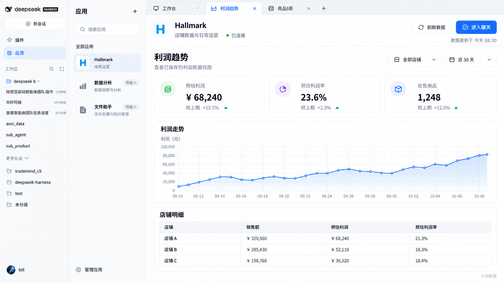
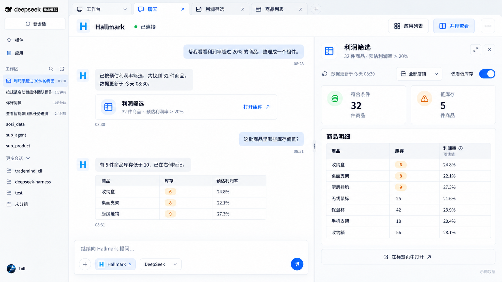

# Apps 桌面前端视觉参考

记录日期：2026-10-07。来源：用户在当前会话提供两张图片，并明确“视觉效果是要这样”。这两张图作为后续前端改造的视觉目标；本文记录要求，不表示当前 candidate.6 已完成这套界面。

**最新范围纠正：用户明确“聊天在任何会话都可以引用这个应用的，只需要 @ 就可以选择应用，不需要单独创建聊天标签……只需要改需要改的位置，不需要整个 DSH 的 UI 都改了”。** 最新文字要求优先于早期参考图中的全局标签。保留当前 DSH 窗口、左导航、项目/会话列表、原消息和输入框，只改插件的应用内容、组件展示和必要 `@` 接入。

当前宿主外壳基准：[用户实际桌面截图](design-reference/20261007-dsh-current-ui.png)。截图显示当时 Apps Runtime 目录和调用记录不可用；这是需要定位的运行状态，不能把空连接或错误提示换成假数据或写死已连接。

用户后续要求重新整理功能与体验，并用生图解释不易表达的部分。完整汇总见 [DSH Apps 桌面应用需求整理](apps-product-requirements-20261007.md)，其中最新示意解释任意原会话 `@` 引用及原生附件/组件保存。

此前候选版本的技术验收与冻结产物保留原记录。本次新增的视觉要求不回填为旧版本已通过的 UI 验收。

## 1. 工作台态

页面结构为：DSH 原导航 → 应用目录 → 所选应用工作区。

- 保留最左侧 DSH 品牌、新会话、插件、应用、工作区及会话导航。
- 应用目录是页面中的第二列，包含标题、搜索、应用图标、名称、说明、选中态和管理入口。
- 应用区内可用局部导航访问概览、组件库与已打开组件，范围限于插件内容；不扩展为 DSH 全局工作台/聊天标签。
- 工作区应用标题行包含图标、应用名、说明、真实连接状态，以及“刷新数据”和组件库入口。聊天通过任意原会话 `@` 引用应用，不要求先经过工作台。
- 数据页面采用标题与说明、筛选条件、指标卡、趋势图和明细表的清晰顺序。
- 指标数字醒目，说明与时间降低视觉权重；金额、比例等数值列对齐，单位和口径可辨。

## 2. 聊天态与并排组件

用户在任意原有 DSH 会话的原输入框输入 `@`，从候选中选择已接入应用并继续提问。需要组件时，页面结构为：DSH 原导航 → 原会话聊天 → 原右侧当前组件。应用页是可选管理入口；没有组件时维持原聊天布局。

- 复用原有 `@` 触发与候选交互，加入真实应用选项及必要引用状态；保留原会话导航，不创建聊天标签、不重新嵌入或替换整套聊天界面。
- 所选应用与连接状态在必要插件位置可辨，不强制给每个原聊天新增整行应用标题与全局操作栏。
- 使用 DSH 原会话、原消息和原输入框，保留应用标识、附件、模型选择与发送能力。
- Agent 生成组件后，聊天中出现带标题、摘要和“打开组件”动作的入口卡片。
- 右侧组件具有图标、标题、条件摘要、展开与关闭动作。
- 组件内部可包含数据时间、刷新、筛选器、开关、指标卡和明细表；低库存等状态采用语义色和可读标签。
- 在应用工作区打开用于从窄栏进入宽组件内容；关闭右侧组件后，原聊天获得更多空间。
- 打开/收起组件、返回应用工作台和组件区局部切换应保留原会话、输入草稿、附件及组件本地工作状态。

## 3. 视觉语言

- 浅色整体采用白色与很浅的灰蓝底，蓝色用于主要操作、活动标签、选中态和链接。
- 绿色用于连接或正向状态，橙色用于低库存等提示；状态同时有文字或图标。
- 采用轻边框、柔和圆角、少量阴影与充足间距，避免将每条信息包成高对比重框。
- 标题、正文、辅助说明、关键数字具有稳定层级；图标大小与按钮高度保持一致。
- 主操作醒目，次操作使用轻背景或描边；搜索、筛选与刷新位置稳定。
- 宽页面和窄组件区分别排版：减少窄栏字段、调整列表形态，长名称和缺图仍可读。
- 无数据、无筛选结果、加载、读取失败、选择和禁用状态都要完整设计。

图片里的数值、店铺 A/B/C、趋势和待接入应用属于示例内容。实际界面使用当前已接入应用及真实数据；数据不足时呈现明确状态。源数据时间、读取成功时间和连接状态各自保持真实含义。

## 4. 与既有体验要求结合

- 用户通过同一原聊天进行业务操作和组件创建、编辑、保存。
- 商品搜索、排序、筛选和勾选在组件本地完成；“附加到聊天”进入原生附件区，由用户补充要求并手动发送。
- 源码组件可复用成熟设计，并通过真实构建、截图和交互反馈继续调整。
- 明确保存后进入组件库，支持重新打开、另存、历史版本、重命名和删除；标签切换不会自动保存或丢弃工作。
- 打开优先展示最近成功快照，显式刷新更新数据并保留设计。

## 5. 实施核对范围

现有 Runtime、Provider、源码资产和组件版本服务可以沿用。Apps 主入口需要完成应用区布局、组件库 UI、组件局部导航和草稿保留；原输入区接入应用 `@` 候选；新版 SDK 的预览协议与截图反馈链也需接齐。

原生 `@` 触发、候选选择和当前会话的应用绑定是需要验证的接线。保持单一 Agent 与原会话数据所有权；不再推进跨 DSH 全局标签或由 Apps 容器重新承载原聊天的路线。

只读核对确认：

- 当前官方客户端有 `inputTriggers.registerSource`，支持 `trigger: '@'` 的候选来源及各会话控制器；可以复用宿主提及体验。
- 当前 Apps 客户端尚未注册应用候选。宿主的引用条目不自动等同 Apps Runtime 会话绑定，需补真实应用/连接与当前原会话的绑定语义，并验证发送、取消、移除与输入保留。
- 原生右侧栏在原聊天中按会话挂载，组件在该扩展点展示即可；应用全局页仅承载自己的工作台/组件内容。见 [右侧栏契约](../test/spike/sdk-sidebar-right-0.2.0-rc.2/package/lib/types/client/service.d.ts#L140)。

视觉验收使用实际桌面宽屏和窄组件区，逐项验证：保留现有 DSH、任意会话 `@` 选择、应用/组件局部布局、蓝白色阶、主要操作、图表表格、真实状态、选择附件、宽窄切换及草稿保留。截图与实际操作结果共同记录。

相关历史资料：[前端设计记录](frontend-design.md)、[视觉原则](../skills/hallmark-component-design/references/visual-direction.md)、[源码组件流程](source-component-plan.md)。
