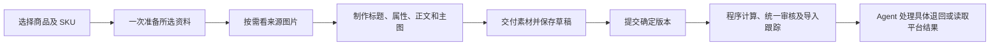

# DSH 采集与上品实际验收

**公开版说明：本文已移除真实商品身份、采购与销售编号映射、具体商品经营金额及会话／操作身份；功能、测试结论和历史验收事实保留。未脱敏原文及真实证据仅保存在本机，不随公开仓库发布。**

2026-10-10 18:00（北京时间）。实际执行版本：`1.0.0-candidate.65`。

**bill 店铺两款商品、每款 5 个 SKU，全部完成导入、商品卡片创建和 Ozon 审核。** 最后一次由 DSH Agent 自己读取平台状态的时间为 17:59:11。10 行均 `is_created:true`、`moderate_status:approved`、`validation_status:success`，错误列表为空。

**10 行目前都没有库存，不能称为已经可购买。** 没有为了验收编造库存。平台审核通过也不等于独立证明全部图文质量；按用户最新要求，没有再增加人工审图关口。

## 实际创建的商品

公开版按匿名商品汇总真实结果；没有用虚构编号或价格代替原始实测数据。逐行销售货号、来源 SKU、Ozon 编号及价格仅保存在本机证据。

| 匿名商品 | 实际 SKU 数 | 导入与卡片创建 | Ozon 审核 | 库存状态 |
| --- | ---: | --- | --- | --- |
| 商品 A | 5 | 全部完成 | 全部通过 | 全部无库存 |
| 商品 B | 5 | 全部完成 | 全部通过 | 全部无库存 |

原先选择的另一款绳扣有 6 个 SKU，被 Ozon 拒绝品牌字段。它们的商品编号、原导入任务和错误记录保留，不算成功商品，也没有用重复创建新货号掩盖失败。DSH 后续自行比较其他商品并选择镜面贴片作为第二款。

## Agent 实际承担的工作

- 初始 11 个 SKU 的上品资料通过两次 `listing.prepare` 完整交付，分别为 13,930 和 11,085 字节。第二款镜面贴片的 5 个 SKU 同样一次准备完整返回。没有让 Agent 为凑齐默认商品事实逐项读取旧平台原始记录。
- 程序负责采购 SKU 与成本绑定、单件／组合包装规则、动态物流定价、素材交付、写入身份与后台导入状态。Agent 制作实际内容并处理品牌等具体业务问题。
- 实际会话没有提交“我看过”“已自检”等审核声明工具。统一审核发生在后台，主 Agent 不维护另一份验证表。
- `candidate.65` 中盘架统一提交约 257 秒、镜面贴片约 176 秒后正常返回待处理状态；后续由程序继续处理，Agent 核查原操作和平台状态。没有靠反复提交同一请求推进后台任务。

恢复段共 68 次工具调用，按用途为内容与素材处理 25 次、来源／类目与替代选品资料 15 次、原生状态／历史结果读取 14 次、计划核查／提交等待 12 次、能力发现 2 次，审核声明 0 次。这包含此前人工指导引发的修正，不能当作一次自主上品的标准调用数。

流程仍有可观察的额外开销：Agent 为重取旧失败商品编号用了六次结果读取，而默认计划摘要此前已经完整返回这些编号，故不是工具字段遗漏，没有为此修改工具。另有一次本机内容处理脚本语法错误，由 DSH 自己修正；一次提交由 root 在此前内容干预阶段主动取消。没有把这些记录从验收报告中删掉。

## 恢复方式和监督边界

历史版本确实出现过素材交付、证据缺失、长请求断开和结果续读问题。按用户授权，修复后使用 DSH 官方会话分叉，从有效节点继续；原会话、失败证据、素材和真实平台回执全部保留。不能把这次验收描述成从零一次通过。

此前 Codex 曾额外查看图片并发送修图指导；最后一条在当前会话 seq607 被消费。这些属于外部内容干预，连同其后执行该指导的步骤如实保留。用户随后明确要求只监督工具流程，因此此后没有再做人工审图或内容指导。DSH 自行完成剩余提交、处理平台状态并核实上述 10 行结果。

## 已修复的工具问题

| 问题 | 结果 |
| --- | --- |
| 获取商品事实产生大结果和上下文噪音 | 精简默认资料、明确续读和总响应预算；准备入口组合采购、包装、规则与类目。 |
| 图片交付需要 Agent 处理底层失败 | 程序保存文件快照、分批交付、有限重试并返回逐文件结果。 |
| 正文没有进入实际 Ozon 字段 | 保存前自动归一到属性 4191，草稿、审核、提交使用同一正文。 |
| 语义审核没有收到可用原图依据 | 按当前商品版本提供有限来源图、角色与 SKU 关系，不要求 Agent 重写事实。 |
| 提交在约 5 分钟断开 | 修复实际本地 HTTP 传输；已安装 SDK 经过真实 310 秒响应头等待测试，完整成功。 |
| 查询原操作时结果过大或字段路径被拒绝 | 经营摘要与按路径读取正常，保留完整原始证据。 |
| 字段验证失败被误当成审核失败 | 区分导入、字段验证、创建、审核和库存状态，保留原生错误。 |

各项定向回归、类型检查、实际安装核对及 310 秒传输证据详见交付记录。测试套件有重叠，没有相加为独立测试总数。

## 可核查资料

- [完整实现与部署记录](collection-delivery-20261010.md)
- [规划及执行记录](collection-implementation-plan.md)
- [实际平台状态摘要](../artifacts/desktop-collection-20261010/acceptance-native-status.json)
- 逐行草稿、采购与平台回执：仅保存在本机 `artifacts/desktop-collection-20261010/`，公开版不列含操作身份的文件名。
- [会话调用观察说明](../artifacts/desktop-collection-20261010/flow-observation-notes.md)
- [故障分叉恢复记录](../artifacts/desktop-collection-20261010/resumption-method.md)
- [DSH 官方会话导出](../artifacts/desktop-collection-20261010/session-export.zip)

当前规范采集接口已经独立；实际资料供应和成品图片发布仍连接旧平台服务。这轮没有把采集数据库迁入 MySQL，不能据此停掉旧平台。
