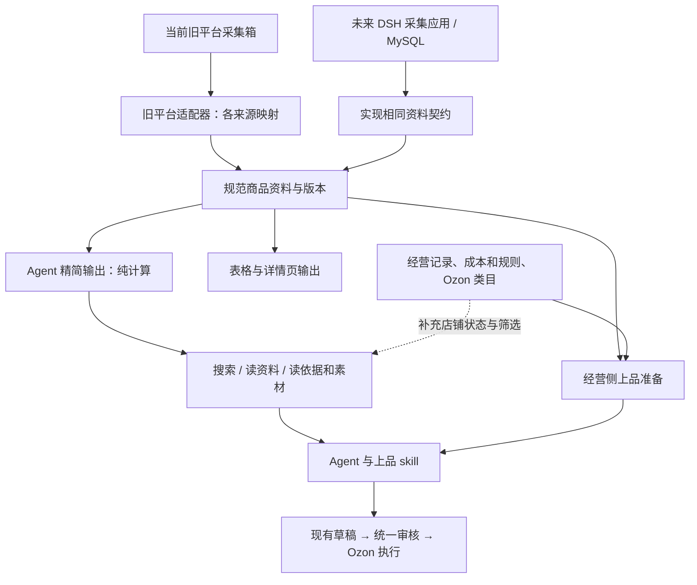

# 采集接口蓝图 v2：三个能力，一个默认资料形态

2026-10-10。以用户提供的原型测算和本轮架构讨论为核心。

状态：用户已认可架构与执行流程，明确认可上品准备入口，并要求兼容多 SKU 同批及组合上品；尚未实现、部署或迁移生产数据。本文取代 v1 的“概览、规格、上品准备”多套采集读取预设。保留 v1 已确认的 DSH 双应用方向、SKU 稳定关联和统一经营审核原则。发货包装口径已确认；用户进一步确认本次讨论的原数据尺寸为厘米、重量为千克。

## 1. 要达到的产品体验

当前插件和未来采集箱都在 DSH 的应用入口中。采集箱维护商品资料，当前插件负责 Ozon 经营。Agent 通过稳定能力取资料，不了解来源数据库或旧平台的文件结构。

现在接旧采集箱；未来接 MySQL 采集应用。保持商品/SKU 身份、字段含义与契约一致，替换连接与适配器，Agent 工具和经营页面继续使用。数据及素材本身仍需迁移，不能把“接口可替换”当作数据已经迁出。

用户的关键要求：信息足够、少噪音、少调用，程序承担格式处理与机械检查；Agent 用 skill 制作内容、自由探索，提交时走统一审核，只有关键事实或经营决策无法解决时询问用户。

本次主要目标是工具使用流畅、取数准确、经营执行连贯。“第六感”是用户的长期目标，不单独建设评分、主动巡检或选品策略系统；保留底层能力供 Agent 自主发挥。

## 2. 证据与设计依据

以下数字来自用户提供的原型测算，本轮没有重跑其脚本或样本。单位保留原报告的 KB 口径，正式基准应明确 UTF-8 字节、样本版本和统计方法。

| 读取 | 旧返回：中位数 / 最大 | 原型新返回：中位数 / 最大 |
| --- | --- | --- |
| 单商品处理后详情 | 30 KB / 137 KB | 2.0 KB / 9.6 KB |
| 单商品原始资料 | 40 KB / 138 KB | 同上，精简资料并非原始数据替代品 |
| 搜索一页 | 100 条约 129 KB | 30 条约 8 KB |

报告指出 FM07-12D 的 70 KB 记录中，编辑器可选值字典约 17.8 KB、重复表单约 16.6 KB 与 15.4 KB、多语言机翻约 4 KB、公司介绍和 FAQ 约 4 KB；搜索任务关系及带跟踪参数的链接也占较大部分。淘宝则以大量 SKU、每行原始嵌套及重复图片地址为主要问题。

源码核对支持其结构性判断：旧 Board 采集列表组合任务与进度；当前客户端按整行 JSON 搜索、原始读取显式请求 full=1，SKU 工具逐行重复商品字段。源码未证明具体体积比例，也不能单独证明以前漏填重量仅由接口造成。

约 2 KB 是样本统计结果，不是强制尺寸。事实更多时允许更大，超量时按语义分页。字节下降不能直接当 token 下降；100 条与 30 条页大小不同，验收还应比较同条数、同一完整任务的资料量和调用次数。

## 3. 架构：一份规范资料，两种展示方式



这表示逻辑职责，不表示要新增多个服务进程。建议先用一个集中维护的采集模块实现规范模型、读取与输出，来源适配器注入其中；复用现有 Runtime、存储和资源引用。未来采集应用可以直接提供规范模型，精简输出继续复用。

| 职责 | 输入 / 输出 | 不承担什么 |
| --- | --- | --- |
| 来源适配器 | 来源字段 → 明确语义的规范资料、原始依据引用 | 不生成 Ozon 文案，不将展示价猜成采购成本 |
| 规范资料 | 商品身份、事实、SKU、报价、素材、来源与版本 | 不存模型摘要作为唯一事实，不使用页面表格行号当身份 |
| Agent 输出 | 规范资料 → 搜索卡片、紧凑资料、可展开入口 | 不访问网络、不调用模型、不写经营记录 |
| 采集读取与素材访问 | 查询、按版本读取、分页、按资源获取图片/原文 | 不检查目标店铺能否上品，不发 Ozon 写请求 |
| 经营侧组合 | 采集资料 + 店铺关联 + 类目要求 + 已采用成本及规则 | 不重复整理第二份采集事实，不强制 Agent 自证 |
| Agent / skill | 判断商品、创作成品、解决具体内容问题 | 不负责解析大 JSON、下载命令、重复计价或主动维持轮询 |

“纯计算”只指精简输出转换。搜索、来源读取、图片下载本来就有 I/O，不能把它们也称为纯计算。

## 4. 三个采集能力

以下名称为拟定契约名，尚未注册；不等于现有 DSH 工具已具备这些行为。

### A. collection.search：搜索卡片

默认每页 30 条。卡片包含身份、标题、来源、末级类目、SKU 数、带价格含义的区间。来源价格还应关联币种、计价单位和必要的数量阶梯，不能将不同单位的区间直接比较。

关键词只匹配标题、型号、属性、类目等商品事实；来源、类目、价格区间、指定店铺状态用结构化筛选。价格筛选应明确筛采购成本还是来源展示价，未知值不当零价参与。

返回 total、按来源/类目的计数和下一页游标。建议计数基于同一版本的完整匹配集合，在所有已生效筛选之后、分页之前计算；不是只统计当前页。类目过多可另读计数页，不能无限展开。若源数据未同步完整，明确计数不完整，不能把局部计数当总数。

**“已在哪些店”由经营侧提供。** 采集搜索返回商品事实；当前插件用稳定商品/SKU 关联补入店铺和经营状态，压成简短摘要。按“未上 bill”筛选时，先完成这项关联筛选再分页和计数。信息不可得时为未知，不能当成未上架。仅创建过任务不等于上架成功，部分 SKU 已上架也不应标成整款已上完。

未来独立采集箱不必复制 Ozon 经营记录。旧任务记录只在迁移期间作为带有历史身份的证据，后续由当前插件的经营记录提供状态。

### B. collection.read：默认就是够用的一份资料

取消 `view=overview / sku / listing` 等必选预设。给商品 ID 即返回默认资料；可指定多个商品或所选 SKU，按需扩展，不需要先读概览才能读详情。

默认内容：

- 商品公共事实一次：标题、来源类目、已采属性、包装重量尺寸、计价单位、起订量、海关编码。带有必要的事实适用范围及依据，不表示自动能用于 Ozon 提交。
- SKU 表：列名一次，每行保留稳定 SKU ID、规格差异与必要报价。所有 SKU 共同属性可提到表外；不能把当前 40 行恰好相同误称为全商品相同，无法确定则明确仅适用于当前选中集合。
- 图片：主图短编号与可用地址；SKU/详情图返回数量和展开入口。SKU 表保留图片关联短编号（可用时），避免展开后不知道哪张属于哪个规格。地址与短编号映射集中保存，不逐行重复 URL。
- 来源描述：总字数、前 1500 个字符与续读入口；说明字符计数口径。来源描述可能是公司介绍，不能自动命名为已核实的商品卖点。
- `unknowns`：来源缺失、单位未核实或冲突等事实问题。
- `available`：本次未返回但可继续读取的资料入口及数量。不要把“未加载”塞入 unknowns 伪装成来源缺失。

40 行为 SKU 默认分页上限。返回 returned、total、nextCursor、版本；长描述按文本段续读，多个商品分别有分页状态。另设整次响应的字节预算，避免批量 10 个长商品绕过单商品限制；未处理的商品返回可继续读取的引用，不能悄悄丢掉。预算数值以测试确定，不要求每个商品都硬塞进 2 KB。

“默认够用”指能开始判断与制作，不承诺任何商品都无须展开。不能把强制摘要当成唯一读取方式，也不能丢失影响规格或成本的事实。

简化形状示例（全部为结构示意，不对应实测商品）：

```json
{
  "id": "item-A",
  "revision": "r3",
  "facts": {"title": "来源标题", "material": "来源材质"},
  "package": {"weight": {"raw": "0.33", "sourceUnit": "kg", "grams": 330, "basis": "已确认来源格式"}},
  "skus": {
    "common": {"unit": "件"},
    "columns": ["id", "color", "sourceDisplayPrice", "purchaseCost", "imageRef"],
    "rows": [["sku-A", "红", {"amount": "5.00", "currency": "USD"}, null, "img-2"]],
    "returned": 1, "total": 1, "nextCursor": null
  },
  "assets": {"main": [{"id": "img-1", "url": "来源主图地址"}], "skuCount": 1, "detailCount": 12},
  "description": {"text": "来源文本片段", "totalCharacters": 3000, "nextCursor": "正文续读引用"},
  "unknowns": ["采购成本未知"],
  "available": ["SKU 图片", "12 张详情图", "剩余正文", "原始依据"]
}
```

SKU 表仅为 Agent 输出形态，规范模型继续使用明确字段和关系。程序的采购绑定与提交读取规范模型，不重新解析 Agent 看到的紧凑文本。

### C. collection.resource.read：读取依据与素材

一个能力覆盖商品关联的原始依据、图片和长文本，类型决定返回内容；不扩展为能访问任意系统文件的通用浏览器。

原始资料用返回的引用或路径定位。对象过大时返回下一层目录、各项大小及读取引用；数组分页、长字符串续读。返回的每段结构完整，不在 JSON 中途截断。原始字段可能含未知但有价值的信息，因此去噪只影响默认输出，不物理删除原始依据。

图片由程序下载、检查类型和大小、缓存并维护商品/SKU 关联。以稳定素材资源引用为跨应用契约，在 Agent 执行所在环境解析成可查看的本地文件或宿主资源；不能只返回未来 MySQL 服务器上的本地路径。Agent 获得资料和看图能力，免于自己写下载命令。缓存不能永久保留失效授权；地址更新与图片内容更新应能区分，成品审核绑定实际内容版本。

## 5. 经营侧上品准备：组合资料，不增加仪式

“上品资料包”不是第四种采集形态，也不是 Agent 必须填写的新表单。它是经营侧把默认商品资料与经营需要组合起来的便利能力。

用户已明确认可经营能力 `hallmark.listing.prepare`（拟新增）：输入目标店铺、选中商品/SKU、可选销售组成、可选已读资料引用；返回精简采集资料或可复用引用、精确店铺关联、类目候选/所需字段、可得成本及缺项。具体类目不明确时不能声称已经拿到全部必填字段，应先返回候选，再按选定类目读取。

可以直接从已选商品调用 prepare，程序内部读取采集资料；不要求 Agent 先调用 search → read → resource → prepare 才能开始。Agent 已经读过的资料按版本复用，prepare 不再整份重复返回。独立选品和“第六感”调查仍可自由使用三个采集能力，不强制经过 prepare。

店铺关联区分：同一个已关联来源 SKU、相同组成、其他相似商品。只有稳定关联才能给出精确对应；标题相似的候选交 Agent 判断，不自动判重或绑定。

内容完成后继续使用已有 `hallmark.plan.create / revise / submit / get / inspect`。`pricing.quote` 按需试算；保存草稿已返回有效报价时不重复试算。审核仍在 submit，prepare 不新设审核门槛。

已采用采购成本、销售组成、成品图文和历史操作记录属于当前插件；采集箱维护来源资料与新报价。来源变化应能同步，但不得悄悄改写历史记录，或将来源展示售价覆盖已核实采购成本。下架等不需成本的动作不应被采集读取牵连。

### 已确认：多 SKU 同批与组合销售

不把“一个采集商品 = 一个销售 SKU”作为数据模型或工具限制。prepare 支持一次处理多个销售规格，每个销售规格独立引用其来源组成；无需 Agent 为每个 SKU 重新读取整款资料。

| 销售规格示例 | 采购组成 | 经营处理 |
| --- | --- | --- |
| 红杯单只 | 红色来源 SKU × 1 | 一条销售行 |
| 蓝杯单只 | 蓝色来源 SKU × 1 | 与红杯同批制作和提交 |
| 红杯两只装 | 红色来源 SKU × 2 | 一条组合销售行 |
| 红蓝各一只 | 红色来源 SKU × 1 + 蓝色来源 SKU × 1 | 一条混合组合销售行 |
| 杯子与杯垫套装 | 杯子来源商品的 SKU × 1 + 杯垫来源商品的 SKU × 1 | 支持跨来源商品的明确组成 |

以上是所需兼容能力和示例，不代表每次自动生成这些组合。用户已指定组合就直接采用；Agent 可在已有授权或经营规则内制作，无需因“多 SKU”本身增加确认。尚未确定销售意图且无法从规则判断时，只澄清该组成。

成本由程序按实际组成、计价单位与报价依据计算；采购组成与平台规格分组分别处理。可以同批提交不意味着 Ozon 必然允许所有商品合成同一商品卡，平台分组遵从实际类目与接口要求。

可共享的标题片段、详情和来源依据复用；颜色、数量、图片及最终发货包装按销售规格绑定。包装由下述用户规则直接处理，不额外进入模型审核。图文等其他内容审核失败只影响对应行或依赖内容；已成功行不重复提交。

## 6. 一次上 10 个商品，具体怎么用

1. 表格提供 10 个稳定商品 ID 和已选 SKU。已有准确选择时不再搜索；选择只表达范围，用户上品指令表达执行意图。
2. Agent 可直接调用拟新增 `hallmark.listing.prepare`。程序内部调用默认采集读取，补店铺关联和必要规则/类目资料；按响应预算返回合适批次和继续引用，批量大小不固定为 3。
3. Agent 根据 skill 制作标题、属性和详情。通过拟新增 `collection.resource.read` 获取需查看的图片；返回宿主可访问资源，再调用实际看图/图片制作能力。长描述或疑点按需展开。
4. `hallmark.plan.create` 保存完成行，程序准确绑定采购 SKU、数量及成本，计算建议价格。未完成内容保存为工作草稿，不靠对话反复复述。
5. Agent 看最终成品后 `hallmark.plan.submit`。程序做确定性检查；图文语义交决策模型，服务不可用时由 Host 启动独立模型子代理。没有新增 preflight、自检声明或第二套 facts。
6. 原请求与平台轮询由后台跟踪；Agent 用 get / inspect 获取必要结果。具体字段被退回就 revise 再提交，成功行不重发。关键未知仍无法核实时只问对应商品的问题。

精简资料提高重量、属性被发现和使用的机会，不保证 Agent 自动填全。程序按确定字段映射和用户包装规则自动填入尺寸重量，语义选择由 Agent 完成。上线验收必须检查实际草稿与平台结果，不能以“返回 11 个属性”推导“已正确填了 11 个”。

## 7. 四项不能含混的事实规则

### 已确认的包装规则：程序直接计算，空值才问

用户已明确：尺寸指发货外包装，重量指含商品及包装的总重量；本次来源数据尺寸单位为 cm、重量为 kg。程序可统一为 mm、g，保留原值，页面显示 cm、kg，不让 Agent 重复换算。

用户最新决定取代之前关于逐 SKU 来源声明、组合包装核实的建议：

- 商品仅有一组尺寸重量时，默认作为该商品所有 SKU 的共用值，不要求来源额外声明适用于全部 SKU。
- 某 SKU 有专属值或用户维护值时，按字段覆盖共用值。
- 多件或多 SKU 组合的重量直接按组成数量叠加，不另算包装差异，不要求重新测量。
- 组合尺寸取找到的已有完整尺寸，直接采用，不做摆放推算或装箱优化。
- 包装规则算出值就继续；返回 null 才由 Agent 识别缺项并询问。不为共用、叠加或尺寸复用新增审批、决策模型审核或“包装适用性”声明。

单 SKU 重量读取顺序：用户维护值 → SKU 来源值 → 商品共用值 → null。尺寸按完整长宽高组读取同样优先级；用户可在表格补齐一组尺寸。

组合规则：用户维护的该组合重量/尺寸分别优先；没有覆盖时，重量 = Σ（成员 SKU 的有效重量 × 数量）。成员必要重量仍为 null 时，组合重量返回 null，不按零或部分和冒充完整结果。尺寸优先组合已有值，否则取成员能找到的一组完整尺寸；为使结果可复现，实现默认按保存的稳定组成顺序取第一组，用户可以在表格覆盖。找不到完整尺寸时返回 null。重量、尺寸分别返回，不因其中一个缺失抹去另一个已得到的值。

程序保留“用户维护 / 来源 SKU / 商品共用 / 按数量合计 / 复用尺寸”等简单计算依据供查看，不把规则结果描述成独立实测，不要求 Agent 对这些依据再写声明。

### SKU 尺寸重量维护表（本次功能范围，尚未实现）

维护入口属于当前插件，提供“单 SKU”和“组合 SKU”两类记录及规则说明；可放在一个表格中筛选切换，避免两套重复数据。

| 表格列 | 含义 |
| --- | --- |
| 商品 / SKU / 类型 | 来源单 SKU 或销售组合的稳定身份 |
| 组成与数量 | 如红杯 × 1、蓝杯 × 1；单 SKU 默认为一件 |
| 长 / 宽 / 高（cm） | 当前采用尺寸，可直接维护覆盖 |
| 重量（kg） | 当前采用重量，可直接维护覆盖 |
| 取值方式 | 共用来源、SKU 专属、重量叠加、复用尺寸或用户维护 |
| 缺项 | 仅明确标出仍为 null 的尺寸或重量 |

支持修改一行、批量应用共用值，以及清除人工覆盖后恢复自动规则。人工维护值保存在当前插件，不被采集同步静默覆盖；来源原值继续保留。组合重量或尺寸单独覆盖，不强迫两项一起填写。

### 发货包装在架构里的完整路径

采集适配器提取来源值及单位 → 规范资料保存商品共用值和 SKU 专属值 → 当前插件用维护表覆盖及单/多 SKU 规则计算 → prepare 返回结果 → 程序填草稿并用于定价。

上品提交与本次自动定价采用同一包装结果版本。销售组成、成员重量或维护值改变后，仅对相关未执行草稿更新结果和报价，已经成功的历史操作不改写、不重发。

Agent 只读取包装结果：有效值继续；例如 `weightGrams: null` 或 `dimensionsMm: null` 时，看到具体缺项即可提问，用户补充后写入维护记录再计算。保留原有统一经营提交入口，但不额外要求模型判断尺寸复用是否合理、重量能否叠加；平台明确拒绝字段时再按返回修正。

包裹实重和物流计费重量分开：目前用户的两套费率按重量计算，不新增体积重除数。未来某渠道配置体积重规则时，程序用发货外尺寸计算该渠道的计费重量；对外申报的实际包装重量不被体积重覆盖。

已有商品的经营利润继续沿用已确认的实际物流重量优先规则，并记录来源；新上品没有实绩时使用本次采用的包装重量。后续物流实绩不自动改写历史草稿或 Ozon 申报。

### 描述与噪音

结构已知的编辑器字典、重复表单、重复翻译等不进入默认资料；选中的属性值必须保留，不能把“可选字典”和“实际属性”一起删掉。无法可靠区分的公司介绍作为来源描述保留，并可标内容用途未判定，Agent 不直接当成商品事实。

### 链接与身份

去除已知无关的跟踪参数，仅用于展示及检索；保留原始链接作为依据。签名、变体和决定页面身份的参数不能盲删。稳定身份不依赖精简后的 URL、数据库行号或当前列表顺序。

### 完整性与未知

“来源没有”“映射暂不支持”“尚未核实”“本次省略/下一页”分别表达。分页绑定资料版本和查询条件，数据改变时明确重读，不静默漏 SKU。普通公共属性只在对应完整范围确实一致时上提；包装另按用户明确的规则：只有一组尺寸重量就默认所有 SKU 共用。本轮缺失不会被压缩成已确认的共同值。

## 8 前置说明：本轮蓝图审阅结论

当前没有阻碍本轮架构实施、需要用户再选择的业务问题。具体字段名、字节预算、缓存和 DSH 资源接入属于实现与测试工作；来源样本不足的映射通过验证逐步补齐，不增加审批步骤。

本轮实现采集读取解耦、精简输出、资源访问、经营上品准备、多 SKU/组合包装维护，以及经营侧旧依赖退出。未来独立采集箱的完整采集任务、编辑删除界面和 MySQL 搬迁放到后续应用建设，不由本轮三个读取能力承包。旧采集箱仍提供数据期间，不能宣称完全关闭旧平台后所有采集功能仍然可用。

采用以下实现默认：组合尺寸有多组可用时按保存的稳定组成顺序取第一组；采集新报价不覆盖用户维护成本，新采集包装不覆盖用户维护包装；同一次草稿保存时固定本次使用的资料与规则版本，后台同步不静默改变待提交的确定版本。新报价进入当前资料，经营采用与更新应清楚展示，不自动触发 Ozon 改价。

本次不另做“第六感”选品、评分或巡检系统。正常图文审核沿用已定原则：同一阻塞问题在首次退回后允许两次实际修改尝试，仍无法解决才升级；技术等待不计修改次数。包装按规则输出，不新增语义审核。

## 8. 旧能力兼容及现有架构落点

当前已有 `hallmark.collected.search`、`hallmark.collected.get`、`hallmark.collected.skus`，还存在明确命名的 `hallmark.api.collected_item.raw`。不能只按“三个别名”数量处理而漏掉原始数据入口。

旧 search、skus 可接到新规范模型；若现有组件依赖行对象或 datasetKey，兼容包装保留它们。新 Agent 使用紧凑输出；旧组件继续拿其原有结构，两者同源。

旧 get 的描述和输出 schema 当前承诺原始 `content/truncated`，改成默认资料属于语义和结构变更。建议：新 Agent 发现入口和 skill 默认使用新 read；旧 raw 保留为显式追查/兼容能力，不作为常规推荐。旧 get 在同步升级 capability version、schema、SDK、skill 与调用方之后可转为新 read 别名；不能在版本不变时假装无破坏兼容。

建议实现落点（模块划分，不是新增部署单元）：

| 位置 | 改动职责 |
| --- | --- |
| 新的集中采集模块，例如 packages/collection | 规范类型、字段来源、紧凑输出、分页及资源引用契约 |
| packages/hallmark-adapter | 旧采集读取与各来源字段映射，隔离 Board 的任务噪音；后续不把源结构透传给经营调用方 |
| packages/app-hallmark | 注册三个能力、补经营店铺状态、上品准备组合；operations-adapter 依赖规范资料而非旧详情 |
| packages/service | 注入采集连接、读取实现与素材访问；采集健康与经营健康分开 |
| 现有 contracts / SDK / presentation | 版本化兼容、组件投影和 Agent 输出；不把 UI 行结构强加给精简资料 |
| 未来采集应用 | 实现同一规范资料与资源契约；MySQL 与对象/文件存储在其内部 |

连接迁移时用稳定逻辑数据源身份配合 ID 对照，替换当前以 sourceOrigin 地址判断数据源是否改变的限制。同一数据搬家不应该丢关联；不同数据源即使 ID 相同也不能混用。

## 9. 实施顺序和验收

1. 固定规范模型、金额/单位/适用范围、三个能力的 schema 与返回形状。单位证据暂缺不妨碍建立结构，但不能启用猜测值。
2. 提取旧平台适配器，先完成阿里和淘宝已覆盖样本；1688、拼多多逐项标明映射覆盖，未验证字段不宣称支持。复用源映射纯函数，未来可迁入独立采集应用。
3. 实现精简搜索、默认资料、原文/图片访问；测试分页、批量预算、SKU 与图片关系。程序直接提供可查看图片，Agent 不自己下载。
4. 接入组件、Agent 与经营准备/提交读取；升级旧工具契约与 SDK，保持旧已保存组件可读。核对实际草稿中的重量、尺寸、属性与来源。
5. 迁出剩余经营兼容依赖：历史采购关联、旧任务回执、旧费率与旧平台健康检查。未决写入按原身份核查，不为断依赖重发。
6. 未来迁入独立采集应用：完整迁成员、资料、原始依据、SKU、素材和版本；切换期间明确单一写入端，验证 ID/成本/历史不变，再退出旧采集运行时。

验收重点：

- 相同样本和任务比较字节、模型 token（指定 tokenizer/模型）、调用次数与事实完整性；页大小分别对齐和不对齐各测一组，不只比较最短 JSON。
- FM07-12D 能取得实际属性、包装原值及可靠单位、海关编码、计价单位；未核实单位准确报告未知。原始记录内容按路径可追查。
- 335 SKU 样本分页无遗漏/重复，按 SKU 精确读取与图片绑定正确。压缩前后成本、币种、单位和组成完全一致。
- 搜 bill 不会因任务字段误命中；“未上 bill”按经营关联过滤；未知与部分上架正确处理，计数与分页一致。
- 图片在 Agent 所在环境可直接查看，不只是在服务端有一个文件；来源失败、图片变化和缓存命中有明确结果。
- 制作草稿和执行验证使用同一规范资料；不会新添声明、双录、反复下载或每步确认。

本轮只完善设计与演示说明，尚未实现上述能力或验证原型数据中的具体统计。

## 源码核对入口

- `packages/hallmark-adapter/client.ts`：旧摘要搜索、详情与 full raw。
- `packages/core/src/collected.ts`：搜索分页及 datasetKey。
- `packages/app-hallmark/src/index.ts`：现有采集能力、raw 入口、schema 和别名。
- `packages/app-hallmark/src/operations-adapter.ts`：采购详情、关联、事实准备与审核输入。
- `packages/app-contracts/src/index.ts`：已有 ResourceRef、DataPage、契约版本与完整性结构，可优先复用。
- `packages/service/src/apps-main.ts`：连接及依赖注入、来源地址身份。
- 旧平台 `src/items.ts`、`src/source-sku.ts`、`src/board.ts`：来源价格、SKU 身份与任务数据合成。
