# 采集资料与上品接入交付记录

**公开版说明：本文已移除真实商品身份、采购与销售编号映射、具体商品经营金额及会话／操作身份；功能、测试结论和历史验收事实保留。未脱敏原文及真实证据仅保存在本机，不随公开仓库发布。**

2026-10-10 18:00（北京时间）。状态：**candidate.65 已安装验证；实际 DSH 会话已完成 bill 两款各 5 个 SKU 的导入、商品卡片创建及 Ozon 审核，10 行全部无库存，尚不可购买。** 原六个绳扣的品牌字段失败及真实回执保留，不计成功。此前人工内容指导与程序故障恢复如实保留，用户明确监督边界后没有再追加人工审图或内容指导。[最终验收结果汇总](collection-bill-acceptance-20261010.md)。下文保留各阶段的记录，阶段性的“待验收”以最终结果为准。

## 本轮实现了什么

Agent 面向当前插件的采集接口工作：选中商品后可直接准备上品资料，按需看图，再制作标题、属性和图片。程序处理来源字段、采购身份、包装换算、定价、素材交付及平台执行状态。接口没有要求 Agent 补交“已看过”“已自检”等声明。

| 能力 | 当前实现 |
| --- | --- |
| `hallmark.collection.search` | 默认 30 条商品卡片，关键词匹配商品事实，排除旧任务文本；来源、类目、价格含义及店铺状态可结构化筛选。统计在筛选后、分页前计算。 |
| `hallmark.collection.read` | 单一默认资料形态：公共事实、采购价含义、包装、SKU 差异表、主图及缺项。支持多个商品、指定 SKU、版本和续页。 |
| `hallmark.collection.resource.read` | 原始资料按路径展开；大对象返回目录，数组和文本可续读。图片由程序下载缓存，以短素材身份关联 SKU，并返回宿主可访问文件。 |
| `hallmark.listing.prepare` | 组合所选资料、销售组成、包装规则、经营定价、已有精确关联及类目候选或模板；准备结果可以分段读取和复用。 |
| 包装维护 | 经营设置中的单 SKU／组合 SKU 维护表；人工覆盖保存在插件，清除覆盖后恢复来源规则。 |
| `hallmark.listing.assets.publish` | 明确选择生成文件后，一次调用完成文件快照、导入、交付和公网内容核对，返回 URL、内容哈希及 SKU 关联；逐文件报告结果。 |
| 现有经营变更工具 | `plan.create/revise/submit/get/inspect` 继续承担草稿、统一审核、写入和结果查询；本轮准备入口没有新增审批步骤。 |

旧采集原始读取的返回契约没有被静默换成精简资料。新的 Agent 路径使用上述能力，兼容路径仍可读取原始依据。

## 数据经过哪些层

```mermaid
flowchart TB
  OLD[旧 trademind_cli 采集服务] --> ADAPTER[CollectionService 来源适配]
  FUTURE[未来 DSH 采集应用<br/>内部 MySQL 与素材存储] -.替换提供者.-> ADAPTER
  ADAPTER --> MODEL[规范商品资料<br/>稳定商品与 SKU 身份、版本、报价含义]
  MODEL --> COMPACT[Agent 精简资料与续读]
  MODEL --> TABLE[页面表格与包装维护]
  MODEL --> PREP[上品准备]
  RULES[插件自己的经营规则、包装覆盖、采购关联] --> PREP
  OZONREAD[店铺精确关联与 Ozon 类目资料] --> PREP
  PREP --> AGENT[DSH Agent 与上品 skill<br/>判断商品、制作图文]
  COMPACT --> AGENT
  AGENT --> DRAFT[现有经营草稿]
  DRAFT --> REVIEW[统一经营审核]
  REVIEW --> OZON[独立店铺连接与 Ozon 执行]
```

规范资料与 Agent 的紧凑表是两种层次。程序计算成本、绑定采购 SKU 时读取规范资料，不反向解析 Agent 的表格。来源商品身份、SKU 身份与采集逻辑数据源共同确定关联，服务器地址搬家不等于商品身份改变；切换为不同数据源时仍需明确映射。

公共属性与已选属性保留，阿里编辑器的选项字典、重复表单、机翻集合和任务进度不进入默认资料。完整来源数据仍可追查，精简输出不等于删除原始事实。来源报价与采购成本分开，阿里卖家报价不会自动变成采购成本；淘宝采购商品价与旧平台包含运费的价格也没有混为同一字段。

## 包装规则如何贯通

来源格式已按用户确认采用尺寸 cm、重量 kg，规范层换算为 mm、g。商品只有一组包装时默认共用；SKU 专属值和人工维护值按字段覆盖共用值。

组合重量按组成数量直接累加。组合尺寸优先人工或已有组合尺寸，否则按保存的组成顺序取第一组完整成员尺寸。任一必要成员重量未知时，组合重量返回 null，不把缺失重量当零；尺寸和重量独立保留可用结果。

准备与草稿执行复用这些规则。已有平台包装只能在精确采购规格对应关系成立时作为依据回用，并记录其来源；不能仅凭相似标题挪用。程序得到 null 就明确列出缺项，包装共用、叠加和尺寸复用本身不会触发额外语义审核或要求 Agent 写适用性声明。

人工覆盖保存在插件自己的仓储内，不被重新采集静默覆盖。改变销售组成后，不会把不相干旧组合的维护值继续套用到新组合。

## 响应大小也是接口行为

DSH 实际 Agent 的首轮回放暴露出资料超过宿主返回预算的问题：调用成功不等于完整资料已进入模型上下文。因此本轮继续修正了程序的返回边界，不能只靠 skill 告诉 Agent 少取数据。

采集搜索、默认资料、依据及图片列表按**整个 JSON 响应**计算字节，包含游标、统计和元数据。安全上限为 14 KiB，给宿主 16 KiB 限制预留外层空间；即使调用方请求 65 KiB，也不能绕过安全上限。单个小商品维持一次读取，不人为拆成多套预设。

- SKU、搜索卡片和图片列表按完整条目分页，不在 JSON 中间截断。
- 长文本按 Unicode 字符续读，不切坏中文或表情。
- 单个字段或条目无法放入一页时，返回明确的预览／省略说明和可读路径；完整内容保存在对应资源中。
- 超大对象返回可分页的目录；特别长的字段名也能通过资源引用完整读取。
- 未返回的页或字段标为部分结果；不能以 complete 掩盖缺失。未知事实与尚未展开仍分别表达。

上品准备、草稿及 Host 的整条链路预算由集成验收进一步核查。采集模块测试通过不等于真实会话已通过验收。

## 哪些仍依赖旧平台

| 依赖 | 当前边界 | 未来替换方式 |
| --- | --- | --- |
| 商品目录、来源商品详情与原始依据 | 当前 `CollectionService` 的客户端仍连接旧平台采集服务。插件保存缓存，但缓存不是独立完整采集箱。 | 新采集应用实现相同商品／SKU 身份和事实契约；替换来源适配器与连接，Agent 能力和精简投影继续使用。 |
| 来源素材地址 | 仍可能指向淘宝、阿里等来源 CDN；查看时由程序下载到当前宿主缓存。 | 独立采集应用迁移素材及其稳定引用；跨机器时用资源暴露接口交付给 Agent，不能只返回远程服务器路径。 |
| 成品图片公网发布 | 当前 `ListingAssetPublisher` 封装旧图片服务的 access、import/local、publish。它仍使用旧服务配置的导入目录和稳定图片服务器。 | 替换图片交付适配器，迁移不可变图片资产、内容哈希、公网 URL／重定向和凭据配置；无需让 Agent 改用旧工作流。 |
| 历史商品／采购关系 | 当前经营侧仍需要已有来源身份及历史关联作为迁移依据；没有稳定关系的商品不能凭名称自动确认已上架。 | 保留原商品与 SKU 的映射和已采用成本，再迁移历史关系；新采集报价不改写历史采购事实。 |
| 旧兼容能力 | 为已保存调用方保留原始读取和部分兼容入口。 | 逐个升级调用方并记录剩余使用，再退出旧入口；不能以新增工具就声称旧服务可以关闭。 |

**本轮没有迁移 MySQL 数据库，没有建设独立采集器，也没有将全部历史资料和素材搬出旧平台。** 当前完成的是接口与经营职责的分离，以及可替换的连接边界。停掉旧采集服务后，未缓存资料和当前图片导入发布仍会受影响。

## 当前证据与验收边界

开发期只读样本通过新采集服务测得：同样 30 条搜索结果从 66,353 字节降至 9,692 字节；旧的整行搜索 bill 命中 56 个商品，新事实搜索命中 0 个。阿里样本（来源身份仅留本机）的处理后资料 44,601 字节，默认输出 5,588 字节，同时保留 11 个属性、6 个规格的独立包装重量、海关编码和图片关联。这些是特定样本的 UTF-8 字节数，不是全体统计或模型 token 测量。

采集单元测试覆盖 335 SKU 无重漏续页、采购价含义、精确包装与图片关系、查询噪音排除、版本变化、批量预算、长标题／长 URL／长字段名、原始对象目录及文本完整续读。图片交付测试覆盖实际文件快照、内容复用、逐文件失败、公网内容不一致和错误脱敏。

`artifacts/collection-listing-20261010/source-products.json`、`source-prep-summary.json` 和 source-images 仅是**开发准备资料与原图下载**。它们不是 DSH Agent 完成创作的证据，不应计入真实上品会话的成绩。

最终验收由 DSH 实际 Agent 执行：选定两款各 5–7 个 SKU，调用真实工具制作标题、属性和图片，提交 bill 并核查逐 SKU 平台结果。报告要分别记录已导入、平台审核、上架／可售状态，以及 Agent 用于制作内容和解决具体问题的调用；不能把已发送请求或 Codex 预先制作内容替代这项验收。

## 已确认的部署与素材交付

| 验收项 | 已有证据与结论 |
| --- | --- |
| 实际安装版本 | `1.0.0-candidate.65` 经官方 Desktop CLI 安装；65 项产物哈希、实际 Host 客户端、Runtime 版本及采集／上品／包装入口一致。证据：`artifacts/desktop-collection-20261010/candidate65-verification.json`。 |
| 大结果字段续读 | 使用实际 Runtime、已绑定会话和规范编码的查询参数，读取已有结果的 `/data/raw/result/0/name`；返回 29 字符和 `complete`。验收记录仅保存长度与哈希。 |
| 模型可用性 | candidate.65 于 17:30 启动核对后模型目录 `ready:true`，默认 `gpt-6-sol`，无供应商失败；数据库完整性为 `ok`，部署检查时没有活动任务。证据：`artifacts/desktop-collection-20261010/candidate65-after-readiness.json`。这是部署时快照，后续新会话已开始验收。 |
| 用户数据保留 | candidate.62 安装前已确认全部会话与 Runtime 无活动任务，按 PID＋创建时间定位停止对象；一致性 SQLite、本次会话小备份及原会话保留，历史证据为 `snapshots/candidate62-minimal/manifest.json`，candidate.65 安装备份见 `snapshots/candidate65-minimal/manifest.json`。candidate.65 只读核对确认原连接、两家店铺、已保存定价和包装入口仍在；部署验证没有平台或设置写入。 |
| DSH 真实素材发布 | 第二次恢复会话（身份仅留本机）中，seq256 一次调用交付 11 张文件，seq257 返回 `status:ok`、资料状态 `ready`、成功 11、失败 0。原始证据：`session-live.jsonl`；具体操作身份仅留本机证据。 |

素材调用内部由程序每批 3 张交付，仅对明确的内容寻址同步失败自动重试一次；失败批不会吞掉其他批结果，返回上游白名单错误码。真实 Agent 仍只需交付选定文件，没有追加上传计划或“已审核”的声明。相关 26 项针对回归与类型检查通过。

**素材发布成功不等于最终内容质量或 Ozon 上架成功。** 历史节点 seq278 尚无本次 Ozon 商品提交，当时两个盘架规格仍需完成每架 9 道隔档、8 个盘位的容量修图。后续 seq290 仅交付这两张修正版本，seq291 成功，其余 9 张沿用成功链接。这个阶段性记录保留；后续失败与当前验收进度见 candidate.64／65 两节。

## 会话恢复与统计口径

原始会话（身份仅留本机）保留，先通过官方 `session/fork` 从 seq217 建立第一次恢复会话（身份仅留本机），再从该会话 seq240 建立第二次恢复会话（身份仅留本机）。各阶段的原始失败轨迹分别保存在 `attempt-01`、`attempt-02`、`attempt-03`，不改写成一次无故障会话。分叉不重放历史平台写入，也不撤销已完成的图片上传；经营回执与原请求身份继续保留。candidate.65 的再次恢复及 `attempt-04` 见下方。

恢复时需要另外核查并清理过期的待处理 inbox 指令：取消当前轮次不等于清空队列，分叉可能继承旧待处理消息。本次旧更正先在 seq247 被消费，新的完整恢复说明没有立即进入模型；seq267 通过官方队列接口移除过期待处理项后，完整指令于 seq272 成为实际 `user/message`。仅清理未消费指令，不删除历史。验收应确认指令实际入历史，而不只看发送接口已接受；这些恢复操作和主动中止造成的两次类目读取取消单独列出，不算正常上品流程的资料验证负担。

## candidate.63 正文修复与续跑

candidate.63 已通过官方 DSH Desktop 安装并重启。`candidate63-verification.json` 核对 64 项打包产物、实际 Host 客户端、运行时、已保存规则、采集／上品／包装入口，以及已存大结果的编码路径续读；`candidate63-after-readiness.json` 确认实际模型目录就绪。安装前一致性 SQLite 备份及本会话备份保存在 `snapshots/candidate63-minimal`。

listing 正文若使用 `payload.description`，在草稿资料加载时转换到 Ozon 属性 `4191`；有效的规范字段优先，冲突仅记录自动处理说明，保留 `11254`、原文和换行。规范化发生在保存与审核前，实际提交使用相同正文。57 项针对测试和类型检查通过，其中集成回归核对正文从草稿到审核、最终 import 的一致性，以及 pending 重提不重复写入。

DSH 已完成两个盘架主图的容量修正并成功交付，仅替换这两张链接。首次真实草稿为 seq295、11 行；程序填入采购／包装／售价并返回完整 13,916 字节。首次审核实际调用指定 Decisions 模型与独立大模型，发现绳扣品牌冲突；提交在正文程序修复前主动中止，该次中止时 11 行均无平台执行回执。candidate.63 随后在原会话接续，最终 Ozon 结果仍待核查。

## candidate.64 证据修复与真实失败

candidate.63 续跑的 seq362 暴露出审核证据不完整：标题／属性和共享详情的语义问题显式使用空 `imageIds`，没有收到实际来源图片；夹紧嵌件结构及 7／20 mm 尺寸虽在原图中可见，文字问题仍报无依据，而独立图片一致性审核已接受结构。这是程序遗漏证据，与此前真实品牌冲突属于不同问题；修复没有要求制作 Agent 编造提取事实或补写审核声明。

candidate.64 完成三项修复：

| 修复 | 当前行为与定向验证 |
| --- | --- |
| 显式证据读取透传 | 实际 `hallmark.plan.get`／`hallmark.listing.draft.get` 的 `includeEvidence:true` 保留所选行的正文、来源上下文及审核结果，不再被默认经营摘要剥掉。小结果完整返回；超大结果保存原始结果并通过 `apps_inspect` 按路径续读。未请求证据的调用仍用紧凑摘要。相关投影、读取与续读回归 30 项通过。 |
| 原图进入语义审核 | `sku-facts` 升至版本 2，`description-facts` 升至版本 3；两者携带实际来源图片、稳定图片 ID 和 `role:source`，要求结合来源文字与实际图片判断。共享详情补入原始 `description`／`sourceDetails`。有图时沿用既有 `image_protocol_unverified` 路由交给独立视觉审核，无图仍优先走配置的 Decisions。未绕过审核或自动通过；相同证据可共享缓存，来源文字或图片引用变化会重审。审核、经营操作和适配器共 70 项定向测试通过。 |
| 多 SKU 提交等待 | 业务调用等待上限从 5 分钟增至 15 分钟，覆盖原生工具、SDK、Host HTTP 调用及能力声明；调用方取消和更短的明确期限仍有效。4 项 deadline 定向测试通过，包括跨过旧 5 分钟限制、短期限终止，以及连接丢失后只核查原回执、不重复提交。 |

上述测试按各自套件记录，不相加声称为互不重叠的测试总数；类型检查通过。candidate.63 的 `description → 4191` 归一化继续保留，保存、审核和 import 使用同一份正文。此次未改变采集来源和图片发布的旧平台依赖。

`candidate64-verification.json` 于 2026-10-10 17:12（北京时间）确认安装版本、64 项产物、实际 Host／Runtime、原有规则和入口，以及编码路径续读的 29 字符完整结果；检查自身为本地认证只读，平台请求、平台写入和设置写入均为 0。`candidate64-after-readiness.json` 随后确认模型目录就绪和数据库完整性。

该轮真实会话为第二次恢复会话（身份仅留本机）。seq384 的统一 `submit` 实际在 306 秒后断开：虽然程序的明确截止时间已改为 15 分钟，Node fetch 的独立响应头默认超时仍为 300 秒，此前假网络测试未覆盖这一层。随后 `apps_inspect(operationId)` 又因未走经营投影返回 `RESULT_SPILL_FAILED`。这些是继续修复的程序缺陷，不能记为 Agent 正常需要承担的验证步骤。

后台已保留六个绳扣的 Ozon 导入任务与商品编号；品牌属性 85 的自由文本不被字典接受，原生状态为卡片未创建、字段验证未通过，`moderate_status` 为空，不能直接称作 Ozon 审核拒绝。其余五行有两行因原图依据遗漏／识别问题退回，三行仍为草稿。本轮没有成功创建 11 张商品卡片。完整观察见 `candidate64-observation.json`；恢复前原会话保存在 `attempt-04`。

当前续跑会话已通过官方 `session/fork` 从 seq359 的草稿保存完成节点建立：最终恢复会话（身份仅留本机）。原计划、Offer、最终图片、采购关联和真实 Ozon 回执继续存在于经营仓储；续跑先核查真实状态，不重建身份，也不把失败轨迹隐藏为一次无故障测试。

## candidate.65 部署、补证与待验收

candidate.64 的只读追查确认碗架／盘架没有 SKU 图片错位：所选 SKU 的原始链接、规范图片引用及审核图片对应一致。但默认审核只带所选图 1 张和主图 6 张，同商品已下载的组合规格（来源 SKU 仅留本机）原图未进入审核；该图同时标有盘架 30 × 7 × 10 cm、碗架 30.5 × 10.5 × 2.5 cm，是实际尺寸依据。不能为通过审核删掉这类有来源的事实，也不能把其他 SKU 的组合件数套给当前销售规格。主图可见 GNS／古奈仕而来源缺少品牌字段仍是真实待核查事项；缺失字段不代表已确认无品牌，程序没有自动改写品牌或放行争议。

| 修复 | 当前行为与定向验证 |
| --- | --- |
| 有界来源补证 | 审核图片总量仍为 8 张以内，去重后按所选 SKU、首张主图、同商品已下载的其他 SKU／详情参考图、其余主图补足。只读取当前来源版本已有的缓存记录，不为 335 SKU 批量下载图片，也不声称图片已经被 Agent 看过。逐图保留商品与素材身份、`selected-sku`／`main`／`other-sku-reference`／`detail-reference` 角色、SKU 标签和来源版本；已下载图片的内容哈希进入审核指纹，同 URL 内容替换或来源版本变化会使相关结论失效。审核明确其他 SKU 的数量不是当前销售数量，结构／尺寸也须核对适用规格；未增加 Agent 声明字段。`sku-facts`／`description-facts`／`visual-consistency` 分别升至 3／4／2，有图走既有独立视觉审核，无图 Decisions 路径保留。 |
| HTTP 等待与结果续读 | 修复显式 15 分钟截止时间之外仍存在的 Node fetch 默认 300 秒响应头超时：本地长调用使用 `node:http`，保留调用方取消和明确截止时间。`apps_inspect(operationId)` 接入经营投影，11 行摘要小于 16 KiB，完整证据保留在 `resultRef` 并按 JSON Pointer 续读；连接丢失后核查原操作，不重复提交。54 项定向测试覆盖 `data-timeout`、`business-inspect-projection`、`business-model-projection` 和 `transport-error-contract`。另以实际已安装 SDK 的默认传输运行独立本地 HTTP 测试：服务端等待 310,024 ms 才返回响应头，调用共 310,031 ms，恰好一次请求并完整成功；没有注入网络或时钟替身。此项验证超过 5 分钟的传输，不计作真实 Ozon 业务请求。 |
| 平台结果表达 | 导入阶段的字段验证失败与平台审核拒绝分开表达，保留原生状态、字段错误及真实导入／商品回执。品牌属性 85 的错误明确为值未被 Ozon 接受，建议核对真实品牌与有效字典值并保持原 Offer；俄文原始错误保留在回执中。`is_created:false` 明示卡片未创建，即使已有商品编号也不推断审核或可售结果；只有明确的审核拒绝状态才称平台审核拒绝。适配器与销售规格客户端 39 项定向测试通过，其中本次新增 3 项，包含原请求只核查不重发及既有采购身份等回归。 |

补证相关采集、适配器、Decisions、经营操作及上品准备套件 99 项通过；加强来源版本回归后，采集与适配器两套件 56 项复验通过，覆盖默认 7 张图仍纳入共享尺寸图、去重、跨商品隔离、未缓存不联网、同 URL 内容变化及来源版本失效。类型检查通过。99／56、HTTP／投影 54 及平台 39 分别为各次套件结果，存在重复覆盖，不相加为独立测试总数。

`candidate65-verification.json` 于 2026-10-10 17:30（北京时间）确认 `passed`、版本 `1.0.0-candidate.65`、65 项产物、实际 Host／Runtime、原连接／店铺／规则及已有结果编码路径续读；包 SHA-256 为 `4dfe4e6bf264df0f6afe3c45f585ccbff0ad996d3f3d960e1b8abe19baac7e07`。验证为本地认证只读，平台请求、平台写入和设置写入均为 0。`candidate65-after-readiness.json` 同时确认模型 `ready:true`、默认 `gpt-6-sol`、无供应商失败、数据库完整性 `ok`。

最终恢复会话（身份仅留本机）已接收 resume65，正在 DSH 内验收。**当前未取得全部 11 SKU 的最终验收结论。** 后续在保留原请求身份与回执的前提下，逐行补充导入、字段验证、平台审核及可售结果；采集与图片服务对旧平台的依赖仍如前述。

## 仍待补充的验收结果

### 监督边界与人工干预说明

用户在本轮续跑中明确：Codex 只监督 DSH 工具与流程，不额外检查图片，也不指导内容制作；发生工具缺陷才修工具并断点续跑。此后内容选择、素材判断、处理统一审核意见及 Ozon 字段退回均由实际 DSH Agent 自主进行。不开设额外图片验收关口，不要求 Agent 补写检查声明。

在此说明之前，Codex 曾人工查看盘架与镜面样片并发送修图意见；镜面样片最后一次指导已在 seq607 被 DSH 消费，不能从实际历史抹去。这些调用计为有外部内容指导的修正，不包装成 Agent 自主一次通过。后续不再追加人工审图或内容提示。软件故障的恢复、外部内容干预和 DSH 自主步骤将在最终会话统计中区分。

2026-10-10 17:40（北京时间）进展：candidate65 中五个置物架原行已全部 `succeeded`（导入完成），257 秒的统一提交正常返回，后续核查没有再出现连接中断或结果溢出。卡片审核／可售仍需刷新原生状态核实。六个绳扣仍因品牌字段失败保留原商品编号，不计为成功。DSH 自主比较另一款六规格按扣，品牌查询中的同名 DIY 字典项标注为玩具品牌，没有采用该值；随后选定五规格镜面贴片（来源身份仅留本机）制作内容，继续完成第二款真实验收。

17:49 完成的独立长等待测试证据为 `artifacts/desktop-collection-20261010/candidate65-installed-sdk-310s-result.json`。它核对了已安装 SDK 的哈希，使用临时本地端口，未读取凭据，未请求实际 DSH 服务或 Ozon；测试结束端口已关闭。平台流程仍须以真实会话回执单独验收。

- 最终图文样例。
- 两款各 5 个 SKU（共 10 个）的真实 Ozon 提交、导入、审核与可售结果；原六个绳扣的失败也单独保留。
- 完整真实会话的资料调用数量、内容制作占比和最终遗留问题。
- 若后续仍需修复，追加最终安装版本与对应回归证据，不能以当前素材交付成功宣告整体验收完成。

## 最终实际结果：2026-10-10 18:00

当前 DSH 会话在 seq739 结束并通过官方接口导出。置物架及镜面贴片各 5 个 SKU，全部实际导入、建卡并通过 Ozon 审核；10 行 `validation_status:success`，错误列表为空，均取得真实 Ozon SKU。最后一次 Agent 平台详情读取为 seq723／727，17:59:11。原生状态同时明确 `has_stock:false`，因此报告为“建卡、审核完成，待库存”，不报告可购买。

candidate.65 分叉后真实主 Agent 共 68 次工具调用。按实际用途重分类：内容制作与本机素材处理 25 次，来源／类目及替代选品资料 15 次，原生状态与历史结果读取 14 次，计划核查／提交等待 12 次，能力发现 2 次，审核声明 0 次。计数包含此前人工指导触发的内容修正，不能当作一次自主上品的标准耗时或标准调用数。Host 正常压缩重放的工具结果不重复计数。

本版本这段流程没有再发生先前的传输断开或 Host 结果溢出。真实局部问题仍保留：一次提交因 root 内容指导而主动取消；一次本机内容处理脚本出现 SyntaxError，DSH 随后修正。工具的 completed 标志不应掩盖脚本 stderr 的实际错误。取旧绳扣编号的六次额外结果读取也保留为 Agent 行为开销：此前默认 `plan.get` 与 `plan.inspect` 已在 `target.productId` 和 `receipt.product.id` 提供全部编号，经核对不属于投影漏字段，未为此改工具。

证据：`acceptance-native-status.json` 保存最终 10 行；`candidate65-platform-status.json` 同时保留 10 行通过与原 6 行字段失败；`session-export.zip` 为官方完整导出；`flow-observation-notes.md` 记录具体归属与局限。文件均位于 `artifacts/desktop-collection-20261010/`。[简明验收报告](collection-bill-acceptance-20261010.md)集中展示结果。
