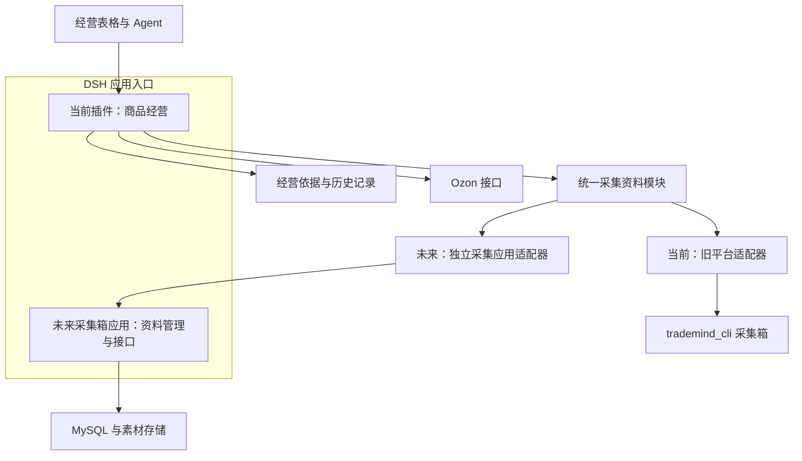

# 采集箱接口与旧平台退出蓝图（讨论稿）

> 已由 [采集接口蓝图 v2](collection-blueprint-v2.md) 取代。v2 采用用户提供的“三个能力、一个默认资料形态”，取消本稿的多套采集读取预设。本稿保留讨论历史，不作为当前接口实施基线。

2026-10-10。依据当前新应用与 trademind_cli 源码调研。本稿描述目标和建议，不代表已迁移、已上线或已确认全部细节；本轮不修改业务代码、配置或真实数据。

## 1. 已确认的方向

本文中的“经营应用”就是当前开发并安装在 DSH 中的插件，并非另一个新项目。后续讨论统一称“当前插件”。

用户已确认：当前插件先建立自己的采集资料接口，现在通过它读取旧平台的采集箱；未来独立采集箱做好后，切换接口背后的数据来源，已有表格、Agent 调用和 Ozon 执行流程不必重做。

用户已确认：未来独立采集箱也在 DSH 的“应用”入口中作为一个应用存在，计划由 MySQL 维护采集资料。独立指职责、数据和对外能力独立，不代表必须另做桌面客户端或脱离 DSH。

最终退出范围包括：采集箱及资料读取、上品采购依据、调价和促销的采购读取、历史采购关联迁入、旧任务回执核查、旧费率试算。它们都需要安排，但不应全部塞进“采集箱接口”。

本阶段方案以统一接口、接入现有采集箱为范围，未来再接入独立采集应用；本次确认不代表现在开始实现独立采集箱或搬迁至 MySQL。“从当前插件贴链接发起采集、刷新和整理商品”尚未确认，可单独讨论，不阻碍先设计资料读取接口。

## 2. 当前代码事实

- 新应用 HallmarkClient 同时承担采集、旧任务、费用配置等调用。采集搜索先取完整 `/api/items` 再本地过滤；原始资料和处理后详情是两条接口。
- 经营操作已能恢复本地采购关联，但 operations-adapter 准备操作时仍逐个读取旧平台商品详情，未按动作区分所需资料。
- 新应用已有独立经营存储，可保存经营记录和采购关联；仍用旧连接地址比较来限制来源变更。未来正常更换采集后端也会触发这一限制，不能仅替换 URL。
- 旧平台 items.ts 保存商品富字段；Board 的采集箱成员还来自事实记录，并组合旧任务进度。因此直接复制 products.json 不能证明完整迁移采集箱。
- 来源 SKU 可能有原生 ID、派生 ID 或唯一编码；代码不能把列表行号当身份。
- 旧平台区分 goodsPrice、price、运费、币种与来源展示价格；部分来源展示价格并非已核实采购价。新接口必须保留这种含义。
- 旧任务核查与旧费率试算仍有运行时调用，必须分别退出。

## 3. 推荐形态

“未来只重新映射一次”指调用方不改、适配器集中调整；并不代表未来的数据搬迁、ID 对照和素材搬迁可以省略。独立采集应用若直接实现同一契约，经营端只需换连接配置。MySQL 是采集应用内部存储选择，经营应用不直连其表结构。

先实现一个职责集中的采集资料模块，复用现有 Runtime 和 Agent 能力注册；本阶段无需为了预留未来另起一个进程、消息队列或数据库。

两者在 DSH 中有各自入口，通过明确的能力接口协作。建议不互读数据库，也不依赖打开对方页面来完成后台调用。具体使用 DSH 应用能力调用还是独立服务接口，在实施前按现有运行机制核实；本稿不假定 DSH 已经提供所有跨应用调用能力。

## 4. 谁维护什么

| 内容 | 推荐责任归属 |
| --- | --- |
| 采集任务、来源商品、来源 SKU、原始属性与图片、来源价格更新 | 采集箱 |
| 规范化读取、旧字段含义转换、分页、同步差异与失败处理 | 统一采集资料模块及其适配器 |
| 销售 SKU、采购组成、采用的采购成本、Ozon 标题与生成素材、利润规则、提交和回执 | 经营应用 |
| 标题与卖点写法、图片策略、选品判断 | Agent 与相应 skill |

采集原稿与 Ozon 成品分开保存。Agent 优化销售标题不应覆盖来源标题；同一来源商品可以供多个店铺和多个销售规格使用。

## 5. 建议接口颗粒度

先固定业务含义，再决定最终方法名和 URL。Agent 无需理解数据库，也无需重复填写来源证明。

| 能力 | 输入与结果 |
| --- | --- |
| 搜索采集商品 | 搜索条件、分页；返回摘要、稳定身份和版本，详情按需读取 |
| 读取商品资料 | 商品身份、可选 SKU 和所需资料；返回规范化商品、SKU、价格依据、素材引用 |
| 获取原始依据 | 商品/资料引用；保留原始资料按需访问能力，避免强迫 Agent 每次读完整大 JSON |
| 同步资料变化 | 同步游标或指定商品；返回新增、更新、移除及可继续的游标 |
| 发起采集或更新（待确认） | 来源链接或商品身份；返回任务 ID，查询任务结果，不阻塞 Agent 轮询 |
| 整理或移除（待确认） | 具体商品与动作；移除采集箱成员不删除经营历史和已上架商品 |

批量读取可复用同一读取契约，避免一批商品产生大量小请求。旧平台没有增量接口时，适配器可拉取列表并对比变化；不能把本地取回时间伪称为上游采集时间。公开行为不依赖旧平台是否支持游标。

管理写入使用稳定请求身份并记录结果；网络结果未知先查询原任务。普通资料读取不经过经营决策审核，也不要求 Agent 声明已经检查。

## 5.1 已确认的新增目标：面向 Agent 降低噪音与上下文占用

用户指出旧采集接口对 Agent 可能不友好，本次接口需针对噪音和大上下文优化。这是新接口的核心目标，不能仅透传旧接口换名称。

源码已确认的具体问题：

- 旧 Board 商品列表混入 listingRequirements、taskRelations、progress 等经营和任务资料；新插件搜索分页后没有逐项投影白名单，仍可能整行返回。
- 新插件采集搜索默认每页 100 条，底层对摘要整对象 JSON 做关键词匹配；可能命中任务等无关字段。旧端全量拉取是传输问题，Agent 收到多少是另一问题，应分别优化。
- `get_collected_item` 工具明确描述为完整原始字段，客户端主动请求 `/raw?full=1`。原始结构还被编码成 content 字符串，增加理解和解析负担。
- 已有 SKU 工具确实做了字段精简，但未提供 SKU 分页/按需范围，且每一行重复商品标题；price 也不足以表达采购价、运费和来源展示报价的区别。
- 当前 spill 处理避免巨量 JSON 直接返回，但将整份资料改为文件路径并不能单独解决 Agent 的阅读负担。

### 建议：少量能力，按任务返回足够资料

| Agent 正在做什么 | 默认返回 | 按需展开 |
| --- | --- | --- |
| 找商品、选候选 | 稳定 ID、简明名称、来源、规格数量、有明确含义的价格区间、资料可用情况 | 指定筛选字段、聚合、候选图片 |
| 判断具体规格 | 商品公共信息一次，所选 SKU 的属性、计价单位、采购报价及图片对应关系 | 其他 SKU、原始报价说明 |
| 制作上品内容 | 一次取得所选商品/SKU 的资料包：来源事实、规格、采购依据、主图/详情图索引、相关描述、关键未知或冲突 | 特定属性原文、完整详情某段、指定图片 |
| 查一个疑点 | 对应字段的原始片段及可继续读取的引用 | 完整原始资料，保留最后追查入口 |
| 给整批商品做分析或展示 | 结果集合引用、计数和概况，必要的样例或候选 | 分页、字段选择、确定性筛选与统计；表格直接读取同一结果集合 |

建议以“搜索、读取资料、读取依据/素材”为少量稳定能力；读取资料支持概览、规格、上品准备等预设，同时允许字段/范围扩展。不要把每个字段变成工具，或让 Agent 为拿齐上品资料顺序调用十几个小接口。预设组织事实，不替代标题、属性和图片创作 skill，不把创作策略写入接口。

### 数据瘦身规则

1. 商品公共信息只返回一次；SKU 只带差异和稳定关联。金额与单位含义集中明确，不能为了省字段把未知成本变成零或展示报价。
2. 去除常规结果中的旧任务历史、无关预处理过程、页面埋点和重复原始嵌套；原始资料继续保存，可精确追查。
3. 采用确定性字段提取、结构化和去重。模型总结如需加入，只能作为派生内容，并保留事实依据；不得用有损总结取代规格、数字或商品事实。
4. 小页默认、批量可选，具体上限经样本测试确定。过大结果按资料段/SKU 分页并明确 returned/total、未包含部分和下一步读取方式，不直接截断 JSON 或悄悄丢字段。
5. 返回稳定素材引用、角色、对应 SKU；避免反复输出长签名 URL 或 base64。Agent 要看图时必须能取得实际图像，缩略图/联系图适合筛选，需核对细节时可取原图，不能拿文件名替代视觉审核。
6. 表格和 Agent 共用同一资料模型，但不同读取投影。页面可展示完整规格和更多列，聊天不必复述整张表；同一查询可绑定结果集合引用，避免 Agent 手搬数百行。
7. 普通响应只集中返回一次必要版本、时间和关键未知信息。错误具体到商品、字段和可执行下一步；调试日志与完整上游报文按需读取，不反复输出验证声明。
8. 为 Agent 的探索保留任意相关字段读取、组合查询和确定性汇总能力，不仅限于预设的上品步骤，也不提前过滤掉程序认为没有价值的商品。
9. 输出大小受控不等于资料完整。明确区分“来源没有”“尚未读取”“本次未返回”“存在冲突”，避免 Agent 将缺省字段误认成不存在。

### 实施时如何判断优化是否有效

对同一批固定样本比较旧、新接口：一次选品/一次多 SKU 上品所需响应字节数、可测的模型 token 数、调用次数，以及完成任务所需关键事实是否齐全。覆盖大量 SKU、长详情、多图、未知采购成本和组合销售；不能只拿单规格短文本证明效果。不预先宣称节约百分比，也不以最短响应作为唯一目标。

当前仅完成源码核对与设计，尚未实现这些返回投影、资料包或结果集合能力，也未测量真实样本的 token 改善。

## 6. 保证未来能够更换后端的必要约定

1. 商品和 SKU 的身份独立于服务地址、MySQL 自增行号及列表位置。保留现有 ID 或永久维护旧新对照；跨来源以命名空间区分。
2. 对外明确金额、币种、计价单位、组成数量、重量单位。未取得的事实返回未知，不按零算；展示报价与经营采用成本分开表达。
3. 资料带版本和可得的来源时间；程序自动生成快照和关联。旧系统无可靠版本时，内容摘要可以用于发现变化，但不是采集时间的证明。
4. 素材以稳定引用连接商品/SKU，访问地址可更新。只保留临时旧 URL 不足以完成独立化；素材须有可持续访问的存储或迁移安排。
5. 采集箱移除商品后保留删除标记，经营中已采用的依据和历史关联仍可追溯。
6. 同一数据源搬家保留逻辑来源身份；接入不同数据源则新建身份，避免碰巧相同的 ID 串错。当前 sourceOrigin 地址比较需随之调整。
7. 接口标明契约版本。供应方增加新字段不应要求经营流程重写；改变价格含义则必须显式升级。

这些由程序维护，不新增 Agent 表单、自证声明或重复校验环节。

## 7. 经营如何使用采集数据

例：来源红杯单件成本 10 元，经营应用创建“两只装”，保存来源 SKU、数量 2 和当时采用的成本依据；系统计算采购组成成本 20 元。跨来源组成同样按每个组成记录。

采集箱后来把单件报价更新到 12 元：同步保留新版本，当前利润依据可以更新为 24 元，而历史发布/改价记录仍保留当时的 20 元；这不自动触发 Ozon 改价。是否自动采用新采购成本需区分可靠来源报价与人工维护成本，不能用来源展示价覆盖人工核实成本。具体采用策略待对齐。

日常调价和促销读取经营应用已采用的采购成本，按实际候选售价、重量匹配动态物流方案。下架通常不需要读取采购详情；库存动作按其实际所需资料执行。

采集箱暂时离线时，已拥有足够依据的经营动作继续；缺少必要事实只影响对应商品/动作。展示资料最后更新时间，不伪称实时数据。上品图文审核读取所引用的资料版本，Agent 不另写一份 facts。

## 8. 其他旧依赖退出方式

| 依赖 | 迁移安排 |
| --- | --- |
| 历史商品采购关联 | 导入经营应用，保留旧 ID、组成数量及依据；仅名称相似不得自动建立精确关联 |
| 旧任务回执 | 已完成任务保存所需结果与来源身份；未完成/结果未知请求携原 requestId、Ozon taskId 和状态迁入，能直查 Ozon 的由新执行层继续查询，不能确定的明确保留待核实，不重发 |
| 旧费率试算 | 需要保留的参数和历史版本迁为应用参考方案，旧模式映射到已导入参考方案；不改变当前动态规则，不再实时读取旧费用接口 |
| 启动及健康检查 | 经营服务不因旧采集平台离线整体不可用；采集连接单独报告状态 |
| 旧任务统计/上品进度 | 历史展示可导入，新进度从经营应用自己的执行记录计算；不复制旧任务体系来支撑采集列表 |

“全部迁移”以运行时没有旧平台依赖为验收终点，不能只统计迁移了多少接口。

## 9. 建议执行顺序及验收

1. 对齐接口范围、资料所有权、成本更新策略，固定必要身份和字段含义。
2. 抽出统一采集资料模块，先实现旧平台适配器；新应用所有采集读取从这里进入，对外兼容已有 Agent 调用和页面。
3. 导入经营所需依据与关联，取消各经营动作直接读旧采购详情，分别迁出旧费率、回执和启动依赖。
4. 若本轮包含管理能力，再接入采集/更新/整理入口；采集状态与 Ozon 经营状态分开显示。
5. 未来独立采集应用实现同一契约；搬迁成员、商品/SKU、素材及版本，切换期间明确唯一写入端，避免新旧两边同时改动而丢失更新。
6. 验证换后端后原 Agent 请求和表格仍可用，ID/成本/组合关系不变；旧平台不可用时已有商品经营可继续；未决回执不重复发送，未知成本不伪造，历史记录不随新报价改变。

本轮是源码研究与讨论稿，未进行 MySQL 建库、生产数据迁移、接口实现、安装或 Ozon 业务写入。

## 源码依据

- 新应用 `packages/hallmark-adapter/client.ts`：采集列表、原始资料、详情及旧平台请求管理。
- 新应用 `packages/app-hallmark/src/operations-adapter.ts`：采购资料读取、关联和经营审核准备。
- 新应用 `packages/app-hallmark/src/operations-client.ts`、`store.ts`：独立经营目录、采购关联与持久记录。
- 新应用 `packages/service/src/apps-main.ts`：连接组成、来源地址身份比较、启动健康。
- 旧平台 `E:/bill学习专区/trademind_cli/src/items.ts`、`source-sku.ts`：资料结构、价格含义和 SKU 身份。
- 旧平台 `E:/bill学习专区/trademind_cli/src/board.ts` 的 `/api/items`：事实成员、富字段、旧任务关系与进度合成。
