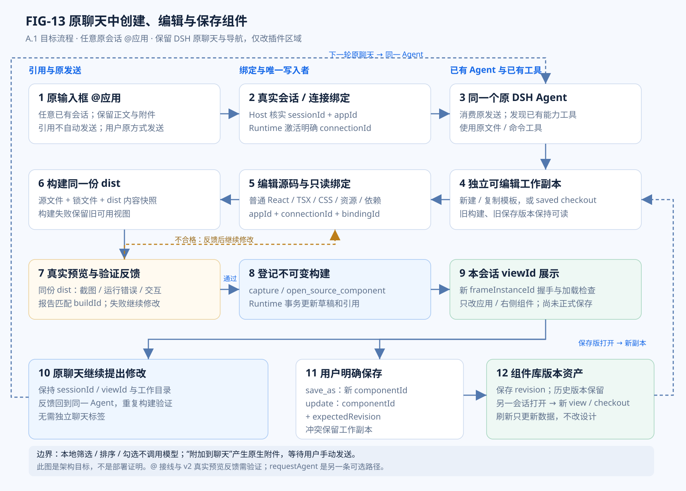
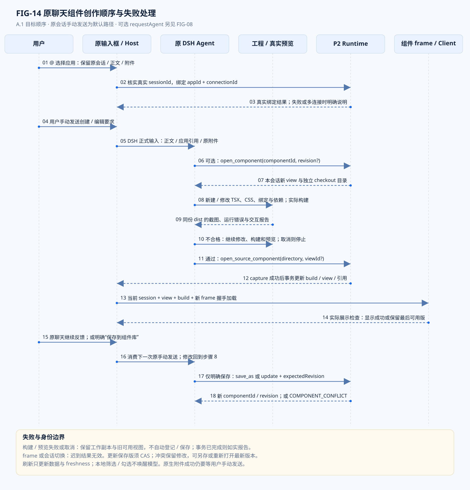

# DSH 多应用框架 · 架构图册与接口说明

> **GitHub 收录说明（2026-10-07）：** 本文件由原项目工作目录收录，文档链接已调整到仓库内；历史任务、基线和验收范围保留。原始现场归档不发布，`evidence/` 路径仅作原开发机定位；公开结果见[发布验证摘要](../apps-publication-validation-20261007.md)。

> 原稿 FIG-01 至 FIG-12 的 SVG/DOT/Mermaid 文件未包含在提供的工作目录中，本文保留各图的文字、关系表与历史图源名称。下方不提供失效的图片链接；本轮 FIG-13 / FIG-14 的完整图面与可编辑源已随仓库发布。

**文件编号：DSH-APPS-ARCH-001　｜　修订：A.1 / 1.0.0-draft　｜　首版：2026-10-06　｜　补充：2026-10-07**

**状态：设计与实施评审稿。** 本文规定建议的目标系统，不表示这些能力已经在仓库实现、安装或验收。所有任务初始状态为 TODO，测试初始状态为 NOT_RUN。

> **A.1 补充范围：** 根据用户 2026-10-07 的最新说明，补齐“任意原会话 `@应用` → Agent 创建/编辑源码组件 → 真实预览与反馈 → 本会话展示 → 明确保存”的闭环。A.0 的基线、任务初始状态和图纸历史语境保留；实际实施状态仍以 TODO、traceability 和对应候选证据为准。本次补充与交互演示不改写历史验收结论，也不表示新的 `@` 接线或界面已完成。仅改应用工作台、组件展示区和必要的原输入区扩展；保留 DSH 原窗口、左导航、项目/会话列表与聊天，不创建独立聊天标签或全局标签栏。

| 控制项 | 内容 |
|---|---|
| 适用项目 | 123wusongzhi/dsh-hallmark-app |
| 代码基线 | `cb871b4086508988485dc4a0a5d6aa5440901267` |
| 当前基线产品版本 | 0.3.0；实际运行版本需现场核实 |
| 目标形态 | 一个 Apps 入口；1+N 逻辑插件；单仓库与一个组合 bundle；V1 一个本机 Runtime 进程 |
| 评审责任 | 架构负责人 A、实施负责人 I、验证负责人 V、发布负责人 R；人员姓名在执行时登记 |
| 规范优先顺序 | SPEC 的编号需求与字段/状态规则 > TODO 的执行顺序 > ARCH 的图示；发现冲突先提交变更单，不自行解释 |
| 阅读约定 | “必须”是放行要求；“不得”是禁止行为；“应”允许记录理由后偏离；“可”是可选能力 |
| 安全范围 | 本次不重新设计权限、安全沙箱或审批体系；现有机制不因架构重构被删除；结果可核实、幂等与故障恢复属于正确性要求 |

> **停止条件：** 当本机 DSH 契约、原应用真实接口或数据迁移前提与本文不一致时，停止受影响步骤，保留证据并更新决策记录。不得把“拟新增”接口当作现有 DSH API 直接调用。

## 00 图纸使用规则

本图册包含 14 张有边界和读图说明的工程图。FIG-01 表示所读基线；FIG-02 至 FIG-12 表示 A.0 目标或目标流程；FIG-13、FIG-14 是 A.1 补充的原聊天组件创作闭环与顺序图。图纸不是安装完成证据。图中未实现对象均应结合 SPEC 和 TODO 阅读。

每张图同时提供 SVG（缩放阅读）、PNG（预览）、DOT（精确排版源）与 Mermaid（GitHub/文档编辑源）。DOT 与 SVG 是本版图面基准；Mermaid 保留相同节点和主关系，但自动布局、分组样式可能不同。两种源修改后必须一起复核，不能让图与文字各自演进。

箭头语义按图确定：调用图表示请求方向；依赖图只表示 import；状态图表示允许转移；数据图表示数据/引用关系。不应把所有箭头都解释为网络请求。每张图下的关系表给出具体含义。

矩形表示模块、状态或步骤；菱形表示必须回答的判断；黄色节点表示未决或停止路径。图纸使用颜色辅助，但仅看黑白和文字也能区分语义。

本版共有四个执行边界：P1 DSH Host、P2 本机 Runtime、P3 Client/iframe、P4 原应用。P3 是逻辑执行上下文，不承诺浏览器 OS 进程数量。

## 01 图纸索引

| 图号 | 名称 | 适用状态 |
|---|---|---|
| FIG-01 | 现有架构：Hallmark 中包含公共平台能力 | 现状 / cb871b4 |
| FIG-02 | 目标逻辑：一个外壳 + N 个原生接入 | 目标 / G2 后 |
| FIG-03 | 部署：四个执行边界与唯一写入者 | 目标 / V1 固定拓扑 |
| FIG-04 | 源码依赖：箭头严格表示 import | 目标 / 依赖检查用 |
| FIG-05 | 调用顺序：三个入口共享一条执行链 | 目标 / PROC-CALL-01 |
| FIG-06 | 变更操作状态机：取消与未知结果 | 目标 / 不适用于普通查询缓存 |
| FIG-07 | 源码资产：工程、构建、视图与组件版本 | 目标 / 保留现有源码路线 |
| FIG-08 | 组件交互分流：不是每次点击都找 Agent | 目标 / 桥接行为图 |
| FIG-09 | 数据所有权与引用关系 | 目标 / 一事实一所有者 |
| FIG-10 | 迁移切换：先冻结，再验证，再开放 | 目标 / PROC-MIG-01 |
| FIG-11 | 异常处置：先判断是否可能已分发 | 目标 / ABN-01..ABN-06 |
| FIG-12 | 实施阶段与放行门禁 | 目标 / TODO 控制图 |
| FIG-13 | 原聊天中创建、编辑与保存组件的闭环 | A.1 目标 / 原会话与局部 UI |
| FIG-14 | 原聊天组件创作的详细顺序与失败处理 | A.1 目标 / 实现与验收顺序 |

## FIG-01 · 现有架构：Hallmark 中包含公共平台能力

**图面状态：** 现状 / cb871b4。**需求：** REQ-001、003、025、040。**任务：** TODO-001、005、006。

> FIG-01 现有架构：Hallmark 中包含公共平台能力：原 A.0 图面未随材料提供，请参阅下方关系说明。

**读图结论：** 本图仅说明已读代码，不代表真实业务链路已验收。AppCore 同时分发业务与展示动作；静态应用目录和单应用会话模型不能直接承担多应用注册。

**边界与禁止解释：** 变化起点是拆职责，不是重写 Hallmark 接口。读取 source components 的存档与业务数据的来源不同，不能把两者合并称“数据库”。

### FIG-01 关系说明

| 起点 → 终点 | 本图中箭头的准确含义 |
|---|---|
| DSH 原生会话 / Agent → dsh-plugin Host / Client / 工具 + 应用目录 + SourceFrame | 原生工具 / 界面事件 |
| dsh-plugin Host / Client / 工具 + 应用目录 + SourceFrame → 本机 Hallmark 能力服务 / service/main.ts | HTTP |
| 本机 Hallmark 能力服务 / service/main.ts → AppCore / 业务动作 + 组件管理混合分发 | invoke |
| AppCore / 业务动作 + 组件管理混合分发 → HallmarkClient / TaskBroker / 原后端适配 | 业务 |
| AppCore / 业务动作 + 组件管理混合分发 → PresentationManager / SourceComponentStore | 展示 |
| AppCore / 业务动作 + 组件管理混合分发 → AppStore / app.db / SCHEMA_VERSION = 2 | 状态 |
| PresentationManager / SourceComponentStore → AppStore / app.db / SCHEMA_VERSION = 2 | 保存 |
| HallmarkClient / TaskBroker / 原后端适配 → 原 Hallmark 后端 / 业务事实来源 | API |

**证据属性：** SRC-03、06、08、09、10、11。**复核：** 图面与 SPEC 相应章节一致；没有增加未说明的第二写入者、回滚保证或原生 API。

**可编辑源：** `diagrams/FIG-01.dot`、`diagrams/FIG-01.mmd`。

## FIG-02 · 目标逻辑：一个外壳 + N 个原生接入

**图面状态：** 目标 / G2 后。**需求：** REQ-002、004、005、042。**任务：** TODO-003、007、010、011。

> FIG-02 目标逻辑：一个外壳 + N 个原生接入：原 A.0 图面未随材料提供，请参阅下方关系说明。

**读图结论：** 1 指 plugin-apps；N 指 plugin-hallmark、plugin-notes 等原生接入插件。Provider 是对应应用的业务半部，运行在 P2；N 不表示 N 个进程或 N 个用户入口。

**边界与禁止解释：** App Runtime 不在编译期 import 所有具体应用，而是按显式模块清单加载。Host 投影仅引用目录，不复制业务算法和能力 Schema。

### FIG-02 关系说明

| 起点 → 终点 | 本图中箭头的准确含义 |
|---|---|
| DSH 已有能力 / Agent · tools · sessions · slots → plugin-apps / 唯一 Apps 外壳 + AppsHost 门面 | 宿主扩展 |
| DSH 已有能力 / Agent · tools · sessions · slots → plugin-hallmark / 原生投影 / 旧工具兼容 | 装载 |
| DSH 已有能力 / Agent · tools · sessions · slots → plugin-notes / 原生投影 | 装载 |
| plugin-hallmark / 原生投影 / 旧工具兼容 → plugin-apps / 唯一 Apps 外壳 + AppsHost 门面 | attachApp |
| plugin-notes / 原生投影 → plugin-apps / 唯一 Apps 外壳 + AppsHost 门面 | attachApp |
| plugin-apps / 唯一 Apps 外壳 + AppsHost 门面 → P2 App Runtime / 唯一能力目录 + invoke + 共享展示 | 目录 / 调用 |
| P2 App Runtime / 唯一能力目录 + invoke + 共享展示 → Hallmark Provider / 业务适配实现 | execute / inspect |
| P2 App Runtime / 唯一能力目录 + invoke + 共享展示 → Notes Provider / 业务适配实现 | execute / inspect |

**证据属性：** 目标设计；插件机制参考 SRC-15。**复核：** 图面与 SPEC 相应章节一致；没有增加未说明的第二写入者、回滚保证或原生 API。

**可编辑源：** `diagrams/FIG-02.dot`、`diagrams/FIG-02.mmd`。

## FIG-03 · 部署：四个执行边界与唯一写入者

**图面状态：** 目标 / V1 固定拓扑。**需求：** REQ-003、034、042。**任务：** TODO-003、007、010。

> FIG-03 部署：四个执行边界与唯一写入者：原 A.0 图面未随材料提供，请参阅下方关系说明。

**读图结论：** P3 为逻辑执行边界，不规定 Electron 创建多少 OS 进程。原应用已有服务不会因此合并进 P2。V1 只新增/复用一个伴随 Runtime，不给每个应用额外开一个微服务。

**边界与禁止解释：** Agent 生成脚本通过 DSH 已有文件/命令能力运行，再由 SDK 访问 P2。脚本所在 OS 进程数由 DSH 执行器决定，不改变 Runtime 唯一写入者约束。

### FIG-03 关系说明

| 起点 → 终点 | 本图中箭头的准确含义 |
|---|---|
| 源码组件 iframe → Apps UI / SourceFrame | bridge |
| Apps UI / SourceFrame → plugin-apps + N 个插件 / dsh-compat / Native tools | 宿主代理 |
| plugin-apps + N 个插件 / dsh-compat / Native tools → Registry / Invocation / Presentation | 本机 HTTP |
| Registry / Invocation / Presentation → Hallmark + Notes Provider 模块 | 进程内 |
| Registry / Invocation / Presentation → apps.db + 构建归档 / 仅 Runtime 写入 | 持久化 |
| Hallmark + Notes Provider 模块 → Hallmark 原后端 / Notes 数据源 | API |

**证据属性：** 目标设计；现有服务基线参考 SRC-08。**复核：** 图面与 SPEC 相应章节一致；没有增加未说明的第二写入者、回滚保证或原生 API。

**可编辑源：** `diagrams/FIG-03.dot`、`diagrams/FIG-03.mmd`。

## FIG-04 · 源码依赖：箭头严格表示 import

**图面状态：** 目标 / 依赖检查用。**需求：** REQ-002、012、028、034。**任务：** TODO-004、006、007、011。

> FIG-04 源码依赖：箭头严格表示 import：原 A.0 图面未随材料提供，请参阅下方关系说明。

**读图结论：** 禁止边：app-contracts → Provider；app-runtime → 具体应用源码；presentation → hallmark contracts；component-runtime → 商品专属类型。组合器读取 Provider 模块名属于装配责任，不等于 Runtime 领域耦合。

**边界与禁止解释：** 新应用验收以 diff 为证据：允许新增应用包、测试、清单和锁文件；不得要求给共享代码加入 appId === notes 等分支。

### FIG-04 关系说明

| 起点 → 终点 | 本图中箭头的准确含义 |
|---|---|
| app-runtime / 通用运行时 → app-contracts / 类型 / Schema / 标识 | import |
| presentation / source-components / 共享展示 → app-contracts / 类型 / Schema / 标识 | import |
| app-hallmark / app-notes / 领域 Provider → app-contracts / 类型 / Schema / 标识 | import |
| app-sdk / component-runtime / 通用客户端 → app-contracts / 类型 / Schema / 标识 | import |
| plugin-apps / N 个投影插件 → dsh-compat / 宿主版本适配 | import |
| plugin-apps / N 个投影插件 → app-sdk / component-runtime / 通用客户端 | import |
| service 启动组合器 / 显式模块配置 → app-runtime / 通用运行时 | compose |
| service 启动组合器 / 显式模块配置 → presentation / source-components / 共享展示 | compose |
| service 启动组合器 / 显式模块配置 → app-hallmark / app-notes / 领域 Provider | load manifest |

**证据属性：** 目标设计。**复核：** 图面与 SPEC 相应章节一致；没有增加未说明的第二写入者、回滚保证或原生 API。

**可编辑源：** `diagrams/FIG-04.dot`、`diagrams/FIG-04.mmd`。

## FIG-05 · 调用顺序：三个入口共享一条执行链

**图面状态：** 目标 / PROC-CALL-01。**需求：** REQ-004、012、017、018、024。**任务：** TODO-007、013、015、016。

> FIG-05 调用顺序：三个入口共享一条执行链：原 A.0 图面未随材料提供，请参阅下方关系说明。

**读图结论：** 步骤 3 的任何歧义、版本或参数错误必须在步骤 5 前停止。步骤 4 是本地去重和恢复锚点。发生未知结果时直接记录并回查，不返回步骤 5 自动重发变更。

**边界与禁止解释：** 脚本中的每个子调用都有自己的 invocationId；同一次业务意图重试复用 idempotencyKey。执行入口不同不应改变业务语义，但不强制结果中时间戳完全相同。

### FIG-05 关系说明

| 起点 → 终点 | 本图中箭头的准确含义 |
|---|---|
| 1 入口 / 原生工具 / SDK / 组件 → 2 Host 或 SDK 绑定调用上下文 / source · sessionId · traceId | 请求 |
| 2 Host 或 SDK 绑定调用上下文 / source · sessionId · traceId → 3 Runtime 解析连接与能力版本 / 验证输入 / deadline | InvocationRequest |
| 3 Runtime 解析连接与能力版本 / 验证输入 / deadline → 4 变更：持久化幂等键与 operationId / 查询：记录 invocation | 解析成功 |
| 4 变更：持久化幂等键与 operationId / 查询：记录 invocation → 5 Provider execute / 复用原后端适配实现 | 分发 |
| 5 Provider execute / 复用原后端适配实现 → 6 结果解释 / 必要时 inspect / 不能以 HTTP 200 代替业务完成 | 证据 |
| 6 结果解释 / 必要时 inspect / 不能以 HTTP 200 代替业务完成 → 7 持久化结果 / Schema 校验 / 完整数据 + 受限模型摘要 | 结果 |

**证据属性：** 目标设计；原有结果语义参考 SRC-02。**复核：** 图面与 SPEC 相应章节一致；没有增加未说明的第二写入者、回滚保证或原生 API。

**可编辑源：** `diagrams/FIG-05.dot`、`diagrams/FIG-05.mmd`。

## FIG-06 · 变更操作状态机：取消与未知结果

**图面状态：** 目标 / 不适用于普通查询缓存。**需求：** REQ-017、018、019、020、022。**任务：** TODO-016、017、024。

> FIG-06 变更操作状态机：取消与未知结果：原 A.0 图面未随材料提供，请参阅下方关系说明。

**读图结论：** 禁止边：unknown → dispatching；pending → cancelled（除非上游明确证明取消且无效果，另行记录证据）。图中 failed/partial 是两个独立枚举，合框仅为版面；数据库必须分别记录。

**边界与禁止解释：** unknown 可维持，不强迫在固定时间变成失败。局部结果包含未决子操作时，流程结果可 partial，但未决子操作仍为 pending/unknown，不得终结后丢弃。

### FIG-06 关系说明

| 起点 → 终点 | 本图中箭头的准确含义 |
|---|---|
| queued / 已落账，未分发 → dispatching / 已越过分发屏障 | 分发屏障 |
| queued / 已落账，未分发 → cancelled / 仅能证明尚未产生业务效果 | 发送前取消 |
| dispatching / 已越过分发屏障 → pending / 上游接受，业务待完成 | 接受 |
| dispatching / 已越过分发屏障 → succeeded / 完成证据充分 | 证据 |
| dispatching / 已越过分发屏障 → failed / partial / 已知终态 | 明确结果 |
| dispatching / 已越过分发屏障 → unknown / 是否完成无法证明 | 证据缺失 |
| pending / 上游接受，业务待完成 → succeeded / 完成证据充分 | inspect |
| pending / 上游接受，业务待完成 → failed / partial / 已知终态 | inspect |
| pending / 上游接受，业务待完成 → unknown / 是否完成无法证明 | 不可确认 |
| unknown / 是否完成无法证明 → succeeded / 完成证据充分 | inspect |
| unknown / 是否完成无法证明 → failed / partial / 已知终态 | inspect |

**证据属性：** 目标状态机；旧状态参考 SRC-09。**复核：** 图面与 SPEC 相应章节一致；没有增加未说明的第二写入者、回滚保证或原生 API。

**可编辑源：** `diagrams/FIG-06.dot`、`diagrams/FIG-06.mmd`。

## FIG-07 · 源码资产：工程、构建、视图与组件版本

**图面状态：** 目标 / 保留现有源码路线。**需求：** REQ-025、026、033、039。**任务：** TODO-006、021、023、025。

> FIG-07 源码资产：工程、构建、视图与组件版本：原 A.0 图面未随材料提供，请参阅下方关系说明。

**读图结论：** 草稿可以为了重启恢复落盘，但“草稿落盘”不等于“进入用户组件库”。buildId 是内容地址，viewId 是展示身份，componentId 是长期资产身份，三者不可相互代替。

**边界与禁止解释：** 源工程的 package-lock 与 dist 一并存档；更新母模板不自动改写已复制工程。旧构建删除必须先检查组件、历史版本和视图引用。

### FIG-07 关系说明

| 起点 → 终点 | 本图中箭头的准确含义 |
|---|---|
| 可编辑工程 directory / TSX / CSS / lockfile → 构建命令 / DSH 文件与命令工具执行 | 编译 |
| 构建命令 / DSH 文件与命令工具执行 → buildId / 不可变源码+dist 清单 | 登记 |
| buildId / 不可变源码+dist 清单 → viewId / 会话草稿 / 引用构建与绑定 | 打开 |
| viewId / 会话草稿 / 引用构建与绑定 → componentId + revision / 显式保存的资产版本 | 显式保存 |
| componentId + revision / 显式保存的资产版本 → 新工作副本 / 旧版本仍保持不变 | checkout |
| 新工作副本 / 旧版本仍保持不变 → 可编辑工程 directory / TSX / CSS / lockfile | 新副本 |

**证据属性：** 目标设计；延续 SRC-11、12。**复核：** 图面与 SPEC 相应章节一致；没有增加未说明的第二写入者、回滚保证或原生 API。

**可编辑源：** `diagrams/FIG-07.dot`、`diagrams/FIG-07.mmd`。

## FIG-08 · 组件交互分流：不是每次点击都找 Agent

**图面状态：** 目标 / 桥接行为图。**需求：** REQ-027、028、029、030、031。**任务：** TODO-019、020。

> FIG-08 组件交互分流：不是每次点击都找 Agent：原 A.0 图面未随材料提供，请参阅下方关系说明。

**读图结论：** updateContext 的确认只表示宿主收到这一版上下文，不表示 Agent 已看到。requestAgent 只有取得 DSH 原生提交回执才可显示 submitted；附加附件成功不得显示任务已发送。

**边界与禁止解释：** 切换 frame 后旧 requestId 回复无效；消息中必须携带 frameInstanceId、buildId 和 viewId。应用业务按钮与 Agent 请求按钮应使用不同动词。

### FIG-08 关系说明

| 起点 → 终点 | 本图中箭头的准确含义 |
|---|---|
| 用户在组件中操作 → 交互类型 | 判定 |
| 交互类型 → 本地 UI / 排序 / 筛选 / 选中 | 本地 |
| 交互类型 → invokeCapability / 明确业务动作 → Runtime | 动作 |
| 交互类型 → updateContext / 保存结构化状态，不唤醒模型 | 上下文 |
| 交互类型 → requestAgent / 原生会话任务输入 | 任务 |
| updateContext / 保存结构化状态，不唤醒模型 → DSH 正式持久会话机制 / 消费时可重建模型输入 | 消费时记录 |
| requestAgent / 原生会话任务输入 → DSH 正式持久会话机制 / 消费时可重建模型输入 | 提交 |
| requestAgent / 原生会话任务输入 → 宿主不支持：明确报错 / 可附加到输入框，由用户发送 | 不支持 |

**证据属性：** 目标设计；现有 v1 路径参考 SRC-10、12。**复核：** 图面与 SPEC 相应章节一致；没有增加未说明的第二写入者、回滚保证或原生 API。

**可编辑源：** `diagrams/FIG-08.dot`、`diagrams/FIG-08.mmd`。

## FIG-09 · 数据所有权与引用关系

**图面状态：** 目标 / 一事实一所有者。**需求：** REQ-003、016、032、034、035。**任务：** TODO-004、007、021、023。

> FIG-09 数据所有权与引用关系：原 A.0 图面未随材料提供，请参阅下方关系说明。

**读图结论：** 图中的 source → provider 表示数据流，不是数据库外键。Runtime 缓存不成为商品权威，DSH 会话日志也不成为应用操作数据库；二者用 invocationId/operationId 关联。

**边界与禁止解释：** 当 Provider 停用时，已保存组件仍可读；其绑定状态变为 unavailable/stale。源业务记录删除后的缓存保留必须显示来源时间，不得伪装为仍存在的实时对象。

### FIG-09 关系说明

| 起点 → 终点 | 本图中箭头的准确含义 |
|---|---|
| 原应用 / 商品 / 订单 / 原始 Note / 业务事实所有者 → Provider / 领域解释 / remoteRef / inspect | 源数据 |
| Provider / 领域解释 / remoteRef / inspect → Runtime / 连接 / 调用记录 / 数据集 / 共享状态唯一写入者 | 证据 |
| 组件版本与绑定 / componentId / revision → Runtime / 连接 / 调用记录 / 数据集 / 共享状态唯一写入者 | 绑定引用 |
| 组件版本与绑定 / componentId / revision → 构建文件 / buildId / 文件哈希 | buildId |
| Runtime / 连接 / 调用记录 / 数据集 / 共享状态唯一写入者 → DSH 原生会话记录 / 模型输入与工具结果 | 正式投影 |

**证据属性：** 目标设计。**复核：** 图面与 SPEC 相应章节一致；没有增加未说明的第二写入者、回滚保证或原生 API。

**可编辑源：** `diagrams/FIG-09.dot`、`diagrams/FIG-09.mmd`。

## FIG-10 · 迁移切换：先冻结，再验证，再开放

**图面状态：** 目标 / PROC-MIG-01。**需求：** REQ-036、037、038、040。**任务：** TODO-023、024。

> FIG-10 迁移切换：先冻结，再验证，再开放：原 A.0 图面未随材料提供，请参阅下方关系说明。

**读图结论：** 原子切换指本机入口和数据库路径切换，不表示跨应用业务原子事务。目标目录和连接必须由实际配置确认；不以 README 示例端口或原开发机绝对路径作为默认。

**边界与禁止解释：** 新系统发生业务变更后不得直接还原旧 app.db 恢复写入。必须先执行 PROC-RBK-01 的增量操作导出与外部结果核实。

### FIG-10 关系说明

| 起点 → 终点 | 本图中箭头的准确含义 |
|---|---|
| 旧 app.db + 源码构建目录 / 基线 v2 → 1 停止新入口 + 排空 / 盘点 pending / unknown | 冻结 |
| 1 停止新入口 + 排空 / 盘点 pending / unknown → 2 一致备份与完整 manifest / 数据库 + 构建 + 配置映射 | 备份 |
| 2 一致备份与完整 manifest / 数据库 + 构建 + 配置映射 → 3 离线副本迁移 / 逐表计数 / 旧新 ID 映射 | dry-run |
| 3 离线副本迁移 / 逐表计数 / 旧新 ID 映射 → 4 校验通过？ | 校验 |
| 4 校验通过？ → 5 新 apps.db 唯一写入 / 原库只读保留 | 通过 |
| 4 校验通过？ → 停止切换 / 保留旧系统状态与失败证据 | 失败 |

**证据属性：** 目标程序；迁移输入参考 SRC-09、11。**复核：** 图面与 SPEC 相应章节一致；没有增加未说明的第二写入者、回滚保证或原生 API。

**可编辑源：** `diagrams/FIG-10.dot`、`diagrams/FIG-10.mmd`。

## FIG-11 · 异常处置：先判断是否可能已分发

**图面状态：** 目标 / ABN-01..ABN-06。**需求：** REQ-018、019、024、045。**任务：** TODO-016、018、024。

> FIG-11 异常处置：先判断是否可能已分发：原 A.0 图面未随材料提供，请参阅下方关系说明。

**读图结论：** 只读回查本身可以受控重试；原始变更不因此重发。错误消息必须区分本机调用失败、平台接受、业务完成三个层次。

**边界与禁止解释：** 应用卸载、网络断开或用户取消不是业务撤销证据。若当前 Provider 不支持 inspect，结果保持 unknown，并列出可人工核对的原业务标识。

### FIG-11 关系说明

| 起点 → 终点 | 本图中箭头的准确含义 |
|---|---|
| 调用失败 / 超时 / 取消 → 是否能证明未分发？ | 判断 |
| 是否能证明未分发？ → 能：failed / cancelled / 修正输入或恢复服务后新调用 | 是 |
| 是否能证明未分发？ → 是否属于变更？ | 否 |
| 是否属于变更？ → 查询：按 read_retry 策略 / 保留旧快照与时间 | 查询 |
| 是否属于变更？ → 变更：unknown / pending / 保留原 operationId，只读核实 | 变更 |
| 变更：unknown / pending / 保留原 operationId，只读核实 → 是否获得完成证据？ | 回查 |
| 是否获得完成证据？ → 按证据结算 succeeded / failed / partial | 证据充分 |
| 是否获得完成证据？ → 保持未决；停止自动重发 / 输出诊断 ID 和缺失证据 | 证据不足 |

**证据属性：** 目标程序。**复核：** 图面与 SPEC 相应章节一致；没有增加未说明的第二写入者、回滚保证或原生 API。

**可编辑源：** `diagrams/FIG-11.dot`、`diagrams/FIG-11.mmd`。

## FIG-12 · 实施阶段与放行门禁

**图面状态：** 目标 / TODO 控制图。**需求：** REQ-043、045、047、048。**任务：** TODO-001 至 TODO-026。

> FIG-12 实施阶段与放行门禁：原 A.0 图面未随材料提供，请参阅下方关系说明。

**读图结论：** 阶段顺序是进入条件，不是日期承诺。允许同阶段中无依赖的任务并行；不得跳过前置门禁，仅凭新代码已合并进入下一阶段。

**边界与禁止解释：** 每个门禁有负责角色和证据目录。测试未运行必须为 NOT_RUN；文档审核、代码实现、模拟测试及真实应用验收分别记录。

### FIG-12 关系说明

| 起点 → 终点 | 本图中箭头的准确含义 |
|---|---|
| P0 / TODO-001..003 / 基线 + Host 探针 + G0 → P1 / TODO-004..008 / 契约与职责抽取 + G1 | G0 |
| P1 / TODO-004..008 / 契约与职责抽取 + G1 → P2 / TODO-009..012 / 连接 / 1+N / Notes + G2 | G1 |
| P2 / TODO-009..012 / 连接 / 1+N / Notes + G2 → P3 / TODO-013..018 / SDK / 发现 / 可靠性 + G3 | G2 |
| P3 / TODO-013..018 / SDK / 发现 / 可靠性 + G3 → P4 / TODO-019..022 / bridge / 上下文 / 组件 + G4 | G3 |
| P4 / TODO-019..022 / bridge / 上下文 / 组件 + G4 → P5 / TODO-023..026 / 迁移 / 回退 / 发布 + G5 | G4 |

**证据属性：** 实施计划。**复核：** 图面与 SPEC 相应章节一致；没有增加未说明的第二写入者、回滚保证或原生 API。

**可编辑源：** `diagrams/FIG-12.dot`、`diagrams/FIG-12.mmd`。

## FIG-13 · 原聊天中创建、编辑与保存组件的闭环

**图面状态：** A.1 目标 / 2026-10-07 补充。**需求：** REQ-025、026、027、028、029、030、031、032、033、034；用户体验细化见 `dsh-hallmark-app/docs/apps-product-requirements-20261007.md` 的 PR-01、03、09、10、13 至 19。**关系：** 扩展 FIG-07 的源码资产生命周期与 FIG-08 的交互分流，不新增第二个 Agent、会话日志或 Runtime。

**读图结论：** 用户在任何已有 DSH 会话的原输入框 `@` 选择应用后，手动发送要求；原 Agent 用已有工具制作或修改组件。构建和真实预览合格后，登记不可变构建并打开/更新本会话草稿；用户在原聊天继续反馈，形成下一轮修改。只有明确保存才进入组件库。

### 13.1 原会话入口与接入边界

1. **原输入框引用：** Apps Client 通过已核实的宿主 `@` 候选扩展点呈现已接入应用；候选使用稳定 `appId`，不能只凭可修改的应用名称判断身份。选中引用保留原正文、附件和原会话焦点，不自动发送，不跳转应用页，不创建会话。取消选择或扩展卸载按宿主契约清理候选和 UI 状态。
2. **真实会话与连接绑定：** 引用所属的真实 `sessionId` 由宿主获取并经 Host 核实；Host/Runtime 将具体 `appId + connectionId` 激活到该会话。原生引用 chip 与 Runtime 绑定是两个状态：只有绑定成功且目录/能力可用，才能声明应用已可调用。多连接无法唯一确定时在原聊天澄清；`shopId` 等领域参数不冒充连接身份。切换界面焦点不删除其他已启用应用。
3. **原发送行为：** 用户点击原发送按钮或使用原快捷键。DSH 原会话持久化本次正文、引用与附件，并由同一个原 Agent 消费。通过已验证工具发现路径取得应用能力、参数 Schema、连接身份及组件工具；不另建聊天历史，不另起自制模型循环。
4. **组件定位：** 当前修改对象以 `sessionId + viewId` 和必要的 `componentId/revision` 明确标识。已打开多个组件且指令有歧义时才澄清。当前组件身份与最近成功构建应通过原工具结果、原生附件或已核实正式投影供 Agent 读取；仅存在 iframe 内存中的选中态不能声称 Agent 已获知。

**已核实与待接齐分别记录：** 本机官方 DSH 0.2.0-rc.2 的 `dsh-client-ui-input-trigger/lib/client.js:904` 使用 `ctx.inputTriggers.registerSource(src)`、`trigger: '@'` 并返回清理函数；官方 `ui-reference/lib/client.js:234` 用同接口处理文件/会话引用。它们来自本机 `app.asar` 内代码，不是新增的项目 API。仓库 `test/spike/sdk-conversation-attachments-0.2.0-rc.2/package/lib/types/client/contract/input.d.ts:85` 为原输入契约核对点。当前 `packages/dsh-plugin/client/plugin.ts:50` 尚无 Apps 的 `inputTriggers` 注册，原目录绑定仍在 `packages/plugin-apps/client/directory.tsx:29`；因此 `@` 候选、正式引用、绑定、取消及跨会话生命周期需完成接线并做桌面验证，不能用此图代替完成证据。

### 13.2 Agent 创作与真实视觉反馈

| 阶段 | 目标行为与实现边界 |
|---|---|
| 新建 | 原 Agent 用已有文件/命令工具，在独立工程目录创建普通 React/TSX/CSS 工程，或复制成熟模板。模板生成独立副本；不是把设计限制为固定 widget 白名单。 |
| 编辑已有组件 | `apps.presentation.open_component` 指定 `componentId` 和可选 `revision`，生成属于本会话的新 `viewId`；`SourceComponentStore.checkout()` 把该构建源码与 dist 复制到新空目录。保留原不可变构建、历史保存版本和其他会话视图。若编辑本会话草稿，明确其工作目录与 `viewId`。 |
| 编辑源文件与绑定 | 原 Agent 修改 TSX、CSS、资源和正常依赖/锁文件；数据绑定仍为 `bindingId + appId + connectionId + capabilityId + input`，绑定只调用 query/compute。设计修改与上品、调价、库存写入分别处理。 |
| 构建 | 在工作副本执行实际工程构建，取得同一份 `dist` 与源工程快照身份。源码、资源、依赖锁和 dist 一起构成内容地址 `buildId`。构建失败保留工作副本、错误和旧可用视图，不覆盖保存版本。 |
| 真实预览 | 实际加载将要展示的同一份 dist，而不是另写示意页面。通过适配 `dsh.apps.component.v2` 的预览载体或真实 DSH 组件框架，取得运行错误、截图、视口/宽度、bridge 状态与交互结果。图表、按钮、筛选、附件、窄侧栏和宽工作台按本轮目标检查。 |
| 反馈与修改 | 原 Agent 读取截图和错误/交互报告，定位真实布局、逻辑或依赖问题，修改工作副本后重新构建、预览。每份反馈关联本轮 `buildId`，不能用前一版截图证明后一版。失败/取消不发布；用户继续聊天的修改要求进入同一循环。 |
| 登记与展示 | 校验成功后登记不可变源码与 dist 清单，打开或更新当前真实会话的 `viewId`；Client 换用新的 frame 身份、完成握手和展示检查后显示本轮结果。成功构建登记仍是草稿，不自动正式保存。 |

**准确对应现有代码：** `scripts/create-apps-source.mjs` 生成普通源码工程；`packages/source-components/src/index.ts` 的 `capture()` 保存内容地址快照、`checkout()` 创建副本。当前“登记构建并开/更新草稿”集成在 `packages/app-presentation/src/index.ts` 的 `openSource()` 与能力 `apps.presentation.open_source_component` 中：先 `capture()` 成功，再在 Runtime 事务内更新 build、view 与引用。图中的“登记”是逻辑步骤，不声称存在独立 `registerBuild` 宿主 API。

**预览适配缺口：** 现有 `scripts/source-preview.mjs` 预览载体使用 `hallmark.source.v1`；新 SDK `packages/component-runtime/src/apps-client.ts` 使用 `dsh.apps.component.v2`。本闭环需要把预览载体与新协议接齐，或在真实 v2 宿主中验证，并提供 Agent 可读取的截图/错误/交互报告。`SourceComponentStore.capturePreview()` 只采纳与当前 `buildId` 相同的报告；截图归档本身不等于视觉或交互已经通过。新的设计与 HTML 演示不能填作既有生产测试通过记录。

### 13.3 三条不同的用户路径

| 路径 | 所有者与模型/业务效果 |
|---|---|
| 原聊天手动发送 | 用户在原输入框写“再加低库存开关”并手动发送，由 DSH 原会话与原 Agent 处理。这是组件创建/编辑闭环的默认入口，不依赖 FIG-08 的 `requestAgent` 适配。 |
| 组件本地交互与附件 | 排序、筛选、分页、折叠和勾选由组件本地状态完成，不新增模型步，不自动修改业务。点击“附加到聊天”才校验 `SelectionEnvelope`、数据 revision 和 `ResourceRef`，通过已核实原生草稿附件能力加入原输入框；正文和旧附件保留，用户手动发送。 |
| 可选组件主动请求 Agent | 显式 `requestAgent` 沿 FIG-08 已验证原生提交路径；只有正式提交回执才能显示已发送。未启用或缺失契约则报告 `UNSUPPORTED_HOST_CAPABILITY`，可改走原生附件＋手动发送。`updateContext` 只发布后续可消费的结构化版本，不唤醒模型；未验证正式投影时不得宣称已进入模型。 |

`@` 引用只是选择原聊天中的应用；它既不等同 Runtime 绑定成功，也不等同组件主动 `requestAgent`。本地 React state、Runtime 上下文、原输入草稿和已提交会话消息分别拥有自己的生命周期。

### 13.4 状态所有者与稳定身份

| 状态 / 身份 | 唯一主要所有者 | 必须保持的关系 |
|---|---|---|
| `sessionId`、聊天历史、原输入正文/附件、模型执行 | DSH 原会话与原输入机制 | 插件按真实会话寻址，不替换历史或建第二份日志；仅用户原发送或已验证正式提交产生新输入。 |
| 原 `@` 候选、临时引用 UI、组件区打开/收起 | Apps Client，经官方扩展点 | 候选的显示不代表绑定成功；卸载有清理；切换会话重新取该会话状态，不能把 A 的当前 view 放入 B。 |
| 应用目录、`connectionId`、会话应用绑定、invocation | P2 Runtime；Host 代理并校验会话 | `appId + connectionId + sessionId` 不由展示名称代替；Host/Client 不直接写 SQLite。 |
| 可编辑工程目录、TSX/CSS、依赖锁、未完成修改 | 工作副本；原 Agent 的文件/命令工具 | 独立于不可变归档。草稿可为恢复落盘；不代表已经保存到组件库。 |
| `buildId`、源文件/dist 清单、预览归档 | SourceComponentStore，通过 Runtime 管理 | 内容地址不可变；预览报告必须匹配 buildId。旧构建仍可被历史版本引用。 |
| `viewId`、`ownerSessionId`、当前 source/绑定、草稿 | P2 共享 Presentation/Store | 更新同一会话草稿保留 view 身份；开放视图前校验所有权。跨会话打开保存组件会创建新 view 和工作副本。 |
| `frameInstanceId`、本地筛选/分页/选择 | 当前组件 frame / Apps Client | 与 session、view、build 握手一致；换 frame 后迟到消息无效。刷新和页面切换的本地状态恢复策略由 Client 实现，不能只承诺后端会自动保留。 |
| `datasetId` / `datasetRevision`、快照与 freshness | P2 Runtime 数据集 | 刷新数据不重写设计或 build；旧选择需重新校验。离线显示最近成功快照及来源时间。 |
| `contextRevision` / `snapshotId` | P2 上下文状态；正式消费投影由已核实 DSH 机制保存 | revision 表示结构化上下文更新，不等于组件保存版本或数据 revision；消费时的内容必须可重建。 |
| `componentId` / 保存 `revision`、历史版本 | P2 保存组件库 | 仅明确保存创建/更新。更新带 `expectedRevision`；保留历史版本，冲突不静默覆盖。 |

**刷新与替换的边界：** `getData()/refreshView()` 更新绑定快照和 freshness，保留 TSX/CSS、build 和已保存设计。源码发布会替换 frame，此时需要按 `sessionId + viewId` 保存/恢复可序列化的 UI 状态并重新校验选择；恢复失败应明确说明，不能把旧数据的选择强行映射到新商品。

### 13.5 明确保存、冲突、取消与失败

- **首次保存/另存：** 用户明确要求“保存到组件库”或点击保存并选择另存时，调用 `apps.presentation.save_component`，传 `viewId`、`userRequest`、`mode: 'save_as'` 和标题，产生新的 `componentId` 与 revision。仅显示或登记构建不调用保存。
- **更新已有组件：** 打开保存组件时记录 `sourceComponentId`、打开的源 revision 和 `baseRevision`。当前实现 `openComponent()` 的 `baseRevision` 为打开时该资产的最新 revision；即使选择历史源码，也不能用历史 revision 冒充更新前提。保存用 `mode: 'update'`、明确的 `componentId` 和 `expectedRevision: baseRevision`。成功产生新 revision，旧版本仍可读；恢复历史版本也保存为新版本。
- **并发冲突：** 返回 `COMPONENT_CONFLICT` 时保留本会话工作副本和预览，提供重新打开最新版本或另存；不自动用最新 revision 覆盖重试，不丢弃他人更新。
- **构建或预览失败：** 显示本轮错误，保留旧可用视图；本轮工作副本仍可继续修改。若已成功登记但加载时才发现运行错误，显示失败并保留最后可用构建引用，允许明确恢复；实现不能把已登记等同已正常展示。
- **取消：** 用户取消本轮创作后停止尚未执行的构建/预览/发布，不更新 view 或保存资产；已完成的文件修改和不可变归档可保留为草稿，记录当前状态。若取消发生在提交事务之后，回执应明确已完成的变化，不能假称撤回成功。
- **关闭或切换：** 关闭组件视图不同于删除保存组件。未保存修改应明确保留、保存或放弃；切换原会话不能让迟到构建或 frame 回复发布到新会话。工作副本仍保留到用户明确处理。

### FIG-13 关系说明

| 起点 → 终点 | 箭头的准确含义 |
|---|---|
| 原输入 `@` → Host/Runtime 绑定 | 使用真实会话与稳定 app/connection 身份核实、激活；不是发送消息 |
| 用户原发送 → 原 DSH Agent | 正式原会话输入；使用现有工具发现与执行机制 |
| Agent → 工作副本 → 构建 → 预览 | 既有文件/命令能力与真实 dist 验证；失败返回工作副本，不发布 |
| 预览通过 → capture/openSource → 本会话 view | 不可变快照登记与草稿事务更新；Client 验证 frame 展示 |
| 用户反馈 → 原输入 → 同一 Agent/工作副本 | 新一轮显式聊天创作；稳定标识修改对象 |
| 用户明确保存 → 保存组件库 | CAS 更新或另存；保留历史，不自动执行领域写操作 |

**可编辑源与详细补充：** [FIG-13 Mermaid](../architecture/chat-component-authoring/FIG-13.mmd)、[DOT](../architecture/chat-component-authoring/FIG-13.dot)、[PNG](../architecture/chat-component-authoring/FIG-13.png)、[补充说明](../architecture/chat-component-authoring/README.md)。图与序列图由同目录 `render_diagrams.py` 的节点/关系生成，颜色只辅助区分阶段。

## FIG-14 · 原聊天组件创作的详细顺序与失败处理

**图面状态：** A.1 目标 / 原聊天手动发送路径。**需求：** 与 FIG-13 相同。序列图中的方法名仅在确有项目实现时标注；“验证/显示/继续修改”是目标步骤，不是捏造的宿主 API。

**顺序约束：** 先核实会话/应用绑定，再消费原发送；先完成工作副本构建和实际预览，再登记/更新草稿；先加载新 frame 并确认显示，再回复已展示。用户明确保存后，Runtime 在同一事务核对 expectedRevision 并生成新组件版本。失败、取消、晚到结果和冲突按 13.5 处理。

### 14.1 端到端示例

1. 用户在已有会话 A 的原输入框选择 `@Hallmark`，写“Bill 店铺，找预估利润率超过 20% 的商品，做成蓝白组件”，按原方式发送。这里的店铺、阈值和数据均为示例需求，不是已执行业务结果。
2. Host 核实会话 A 与 Hallmark 的连接绑定；原 Agent 发现 query/compute 与 `apps.presentation.*` 能力，通过 Runtime 获取带来源时间的真实数据。必要信息缺失才在原聊天澄清。
3. Agent 新建/复制普通源码工程，建立只读数据绑定，写指标、筛选和表格，构建 dist；在窄侧栏和宽内容区真实预览、查看截图并检查搜索、排序、选择。发现表格溢出时返回 CSS 修改并重新检查。
4. 校验成功后以 `open_source_component(directory, viewId?)` 登记构建并开/更新 A 的草稿，右侧显示组件。聊天回复包含组件名称、摘要及打开入口；不自动保存到组件库。
5. 用户继续在原聊天写“加一个仅看低库存开关，库存小于 10 的用橙色标记”。原 Agent 针对同一 `viewId` 的工作副本修改并重复构建/预览；普通切换开关由本地 UI 处理，不再问模型。
6. 用户勾选商品并点“附加到聊天”，产生带 `ResourceRef`、bindingId 和 datasetRevision 的原生 JSON 附件，原正文与旧附件保留；用户写要求并手动发送后，原 Agent 才消费这些选择。
7. 用户说“把它保存为我的利润筛选”。明确保存产生 componentId/revision。用户之后在原会话 B `@Hallmark` 并打开该组件，会得到属于 B 的新 view/工作副本；B 的修改未保存前不影响 A 或组件库。
8. 若 A、B 都基于同一最新 revision 修改，先保存者产生下一版；后保存者得到 COMPONENT_CONFLICT，保留自己的修改，选择重新打开最新版本或另存。历史版本未被覆盖。

### 14.2 本补充的可验收场景（新验证计划，不是通过记录）

| 场景 | 用户动作与观察要求 | 对应需求 |
|---|---|---|
| AC-13-01 | 在两个已有会话分别 `@` 应用，原文本/附件/会话不变；候选、引用与 Runtime 绑定一致，取消/失败清楚。 | REQ-025、031、034 |
| AC-13-02 | 从原聊天新建 React/CSS 组件；截图与报告对应实际 dist/buildId；右侧显示本会话草稿，组件库未新增。 | REQ-025、026、027 |
| AC-13-03 | 原聊天要求改 CSS、加筛选；Agent 修改同一工作副本并重新预览；本地筛选模型调用增量为零。 | REQ-025、029 |
| AC-13-04 | 引入构建错误、运行错误或取消；旧可用视图/旧保存版可恢复，本轮未被假报成功，迟到回复不跨 frame/会话。 | REQ-025、027 |
| AC-13-05 | 编辑保存组件创建独立 checkout；明确 save_as/update 后才新增资产版本；旧版仍存在，冲突保留修改。 | REQ-026、033 |
| AC-13-06 | 筛选/勾选后附加 JSON 到原输入区，正文与旧附件保留；未按发送前没有新模型步。发送后 Agent 能读取稳定资源与来源。 | REQ-028、029、031 |
| AC-13-07 | 刷新只改变数据/时间/freshness，布局与 build 不变；离线保留旧快照；数据 revision 变化拒绝失效选择。 | REQ-028、032、033 |
| AC-13-08 | 同一组件在 A、B 两会话打开得到不同 ownerSessionId/viewId/工作副本；A 的修改、取消和晚到构建不覆盖 B。 | REQ-026、027、031 |
| AC-13-09 | 原聊天创建/编辑与可选 requestAgent 分别检查；适配 disabled 时手动路径仍工作，主动路径报不支持，不伪造已发送。 | REQ-030、031 |

**可编辑源：** [FIG-14 Mermaid](../architecture/chat-component-authoring/FIG-14.mmd)、[DOT](../architecture/chat-component-authoring/FIG-14.dot)、[PNG](../architecture/chat-component-authoring/FIG-14.png)。生图与交互 HTML 仅解释本章目标，不能替代这些真实桌面验收。

**体验评审材料：** [成果入口与体验顺序](../chat-component-authoring-review.md)、[模型生成的说明图](../design-reference/20261007-chat-authoring-architecture-generated.png)、[生图提示词](../design-reference/imagegen-prompts-chat-authoring-20261007.md)、[交互 HTML](../prototypes/chat-component-authoring.html)。HTML 为离线示例与流程模拟；保留原会话入口，组件库保存、失败与冲突可点击体验。

## 80 接口穿越矩阵

| 穿越边界 | 数据/动作 | 允许方式 | 不允许的捷径 |
|---|---|---|---|
| P3 → P1 | 工作台请求、组件数据和动作 | 已核实 DSH 连接代理 | Client 直接读 SQLite |
| iframe → SourceFrame | bridge 请求/事件 | 握手、requestId、frameInstanceId、明确方法 | 旧 frame 迟到回复覆盖新构建 |
| P1 → P2 | 目录、调用、组件和状态 | 项目 HTTP protocol 1；精确版本握手 | Host 自行定义第二份能力 Schema |
| 脚本 → P2 | SDK 子调用 | 统一 InvocationRequest、runId、stepKey | 受管理流程中绕过 SDK 丢失调用记录 |
| Runtime → Provider | execute / inspect | 进程内 AppProvider 协议 | 公共层包含 Hallmark 业务分支 |
| Provider → P4 | 原应用 API/SDK/CLI | 已核实参数、结果与回查语义 | 用网络成功冒充业务完成 |
| Runtime → 持久状态 | 调用、快照、构建与版本 | 唯一写入路径和事务 | 新旧服务同时写相同逻辑操作 |
| Runtime/Host → DSH 会话 | 工具结果与模型上下文 | 已核实正式会话机制 | 直接改写历史日志或另造聊天历史 |

本矩阵只约束框架内受管理路径，不声称能够禁止用户在其他命令工具中自行操作原应用。绕行调用不自动具备本框架的恢复和审计语义。

## 81 典型任务的端到端读图

### 场景 A：查询商品并记录 Notes

用户在原会话指定 Hallmark 连接和 Notes 连接。Agent 通过目录确认两个应用能力，按 FIG-05 查询商品，再用生成 SDK 对结果做筛选。创建笔记是一个独立变更，按照 FIG-06 先落账。流程由 FIG-09 的资源引用连接，而不是按名称猜商品。

若创建笔记成功但随后图表构建失败，业务笔记仍已存在。流程结果为部分完成，不能从头重跑创建笔记。恢复按脚本 stepKey 与 operationId 只补未完成构建。

### 场景 B：定制组件并请求 Agent 分析

用户在任意已有会话的原输入框 `@应用` 并手动发送制作或编辑要求，Agent 按 FIG-13/14 创建或 checkout 源码，修改、构建、真实预览并继续迭代，再按 FIG-07 登记并显示本会话草稿。用户继续在原聊天反馈即可进入下一轮，不需要独立聊天标签。用户排序/选择时只改变本地状态；点“附加到聊天”进入原生附件，仍由用户手动发送。只有明确的组件主动“请求 Agent”动作才进入 FIG-08 的 requestAgent 路径；宿主未支持该方法时明确报错，不能把附加成功显示为已发送。

用户要求保存后产生 componentId/revision。关闭会话不会删除保存资产；再次打开先读取设计与已知快照，再分别刷新绑定。后端离线不等于组件本身不存在。

### 场景 C：调价请求丢失响应后重启

FIG-05 已越过分发屏障，但未取得回执。Runtime 将操作置 unknown。重启后沿 FIG-06 和 FIG-11 使用原 operationId 与远端引用只读核实。不能因 Promise 拒绝、Host 关闭或用户再次询问就用新键重新发调价。

只有原应用给出业务完成证据后才结算。不存在可回查接口时，保持 unknown 并明确列出缺失证据；不凭 404 推定原请求未发送。

### 场景 D：新增第三个应用

新增 Provider 包、原生投影包和分发清单。按 FIG-04 检查公共代码没有领域分支；按 FIG-03 在现有 P2 进程装载 Provider；按 FIG-02 形成新目录投影。无需新建第二个 Apps 入口，也无需复制共享组件系统。

## 82 图纸复核与修订清单

- [ ] 每张图标出现状或目标，不把建议当已实现。
- [ ] 每个模块有进程归属和唯一主要责任。
- [ ] 每条箭头在关系表中有说明，没有无名网络链路。
- [ ] 状态机没有 unknown 自动返回分发的边。
- [ ] 插件数量、进程数量、应用连接和组件数量未混用。
- [ ] 保存资产、缓存和原应用业务事实的所有者不同且清楚。
- [ ] Mermaid、DOT、SVG 和 SPEC 的节点/关系没有矛盾。
- [ ] 发布前由 A 与 V 记录图纸版本、需求覆盖和修改理由。

修订记录：A.0 为 2026-10-06 首版评审稿；没有实现或实测签认。A.1 / 2026-10-07 根据用户“补齐原聊天中 Agent 创建/编辑组件架构”的要求新增 FIG-13、14 与 13.1 至 14.2，并修正场景 B 的默认路径为原聊天手动发送，覆盖 REQ-025 至 034 的相关条目。最新用户边界撤回独立聊天标签与全局 UI 改造。本次仅文档/图示补充，不重写候选版本或旧测试状态。后续修改必须关联变更原因、REQ 和具体图号，不只替换图片不说明理由。

## 90 参考资料与证据边界

以下仓库资料均按基线提交固定。引用只证明所读源码或文档中的事实；不证明当前本机安装、真实接口在线或业务修改已验收。

### SRC-01 · 仓库基线及交付边界
`README.md`

已有版本、源码组件交付记录及未完成验收；历史测试结果不是本次重跑结果。

[基线源码](https://github.com/123wusongzhi/dsh-hallmark-app/blob/cb871b4086508988485dc4a0a5d6aa5440901267/README.md)

### SRC-02 · 工具与结果契约
`packages/contracts/src/index.ts`

26 个 define 条目；现有结果状态、hallmark_* 名称、输入 Schema。README 的 25 工具为历史口径，本规范以此文件清单为迁移依据。

[基线源码](https://github.com/123wusongzhi/dsh-hallmark-app/blob/cb871b4086508988485dc4a0a5d6aa5440901267/packages/contracts/src/index.ts)

### SRC-03 · DSH Host 接入
`packages/dsh-plugin/server/index.ts`

工具注册、动态指令、生命周期、工具目录一致性检查。

[基线源码](https://github.com/123wusongzhi/dsh-hallmark-app/blob/cb871b4086508988485dc4a0a5d6aa5440901267/packages/dsh-plugin/server/index.ts)

### SRC-04 · Host 结构类型
`packages/dsh-plugin/server/types.ts`

来自 0.2.0-rc.2 Inspect 的本地结构声明；不能当作新接口已获支持的证据。

[基线源码](https://github.com/123wusongzhi/dsh-hallmark-app/blob/cb871b4086508988485dc4a0a5d6aa5440901267/packages/dsh-plugin/server/types.ts)

### SRC-05 · 应用目录
`packages/dsh-plugin/client/registry.ts`

静态 APPLICATIONS 与 Hallmark 判断。

[基线源码](https://github.com/123wusongzhi/dsh-hallmark-app/blob/cb871b4086508988485dc4a0a5d6aa5440901267/packages/dsh-plugin/client/registry.ts)

### SRC-06 · 业务与会话分发
`packages/core/src/index.ts`

业务动作和通用组件动作混合分发。

[基线源码](https://github.com/123wusongzhi/dsh-hallmark-app/blob/cb871b4086508988485dc4a0a5d6aa5440901267/packages/core/src/index.ts)

### SRC-07 · 单应用状态与领域类型
`packages/core/src/types.ts`

sessionId 单键、Hallmark 领域对象、参考利润解释。

[基线源码](https://github.com/123wusongzhi/dsh-hallmark-app/blob/cb871b4086508988485dc4a0a5d6aa5440901267/packages/core/src/types.ts)

### SRC-08 · 服务进程及路由
`packages/service/src/main.ts`

独立进程组装、操作恢复和调度；路由另见 packages/service/src/server.ts。

[基线源码](https://github.com/123wusongzhi/dsh-hallmark-app/blob/cb871b4086508988485dc4a0a5d6aa5440901267/packages/service/src/main.ts)

### SRC-09 · SQLite 状态
`packages/store/index.ts`

SCHEMA_VERSION=2、现有集合、幂等键索引和快照保留。

[基线源码](https://github.com/123wusongzhi/dsh-hallmark-app/blob/cb871b4086508988485dc4a0a5d6aa5440901267/packages/store/index.ts)

### SRC-10 · 源码组件协议
`packages/component-runtime/src/client.ts`

现有五种桥接方法及商品专属选择类型。

[基线源码](https://github.com/123wusongzhi/dsh-hallmark-app/blob/cb871b4086508988485dc4a0a5d6aa5440901267/packages/component-runtime/src/client.ts)

### SRC-11 · 展示与版本
`packages/presentation/src/index.ts`

源码/构建归档、草稿和组件保存；绑定限制另见 validation.ts。

[基线源码](https://github.com/123wusongzhi/dsh-hallmark-app/blob/cb871b4086508988485dc4a0a5d6aa5440901267/packages/presentation/src/index.ts)

### SRC-12 · Agent 与组件交互
`docs/agent-component-interaction.md`

代码编译、登记构建、勾选与提交消息的实际区分。

[基线源码](https://github.com/123wusongzhi/dsh-hallmark-app/blob/cb871b4086508988485dc4a0a5d6aa5440901267/docs/agent-component-interaction.md)

### SRC-13 · 原生接入决策
`docs/decisions/0001-接入决策.md`

原生优先、实际运行时契约核实要求。

[基线源码](https://github.com/123wusongzhi/dsh-hallmark-app/blob/cb871b4086508988485dc4a0a5d6aa5440901267/docs/decisions/0001-接入决策.md)

### SRC-14 · 模型结果预算
`packages/dsh-plugin/server/render.ts`

完整值与模型内容分离、默认 16384 字节预算和文件引用。

[基线源码](https://github.com/123wusongzhi/dsh-hallmark-app/blob/cb871b4086508988485dc4a0a5d6aa5440901267/packages/dsh-plugin/server/render.ts)

### SRC-15 · DSH 官方架构
读取于 2026-10-06；所读文件 blob SHA：8514fd8bd3e7312f2b25d0fe2f28d2da778cf8ff。用于插件、服务、可撤销注册及 bundle 概念；不据此确认用户本机接口。

[来源](https://github.com/deepseek-ai/deepseek-harness/blob/master/docs/architecture.md)
