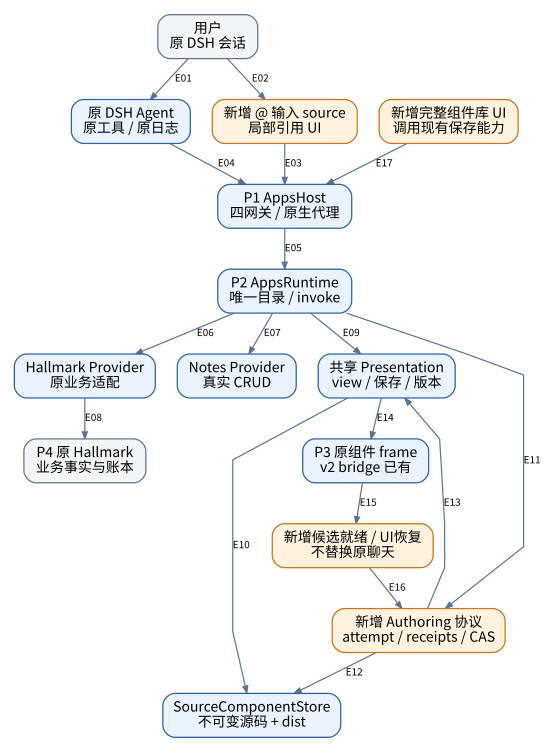
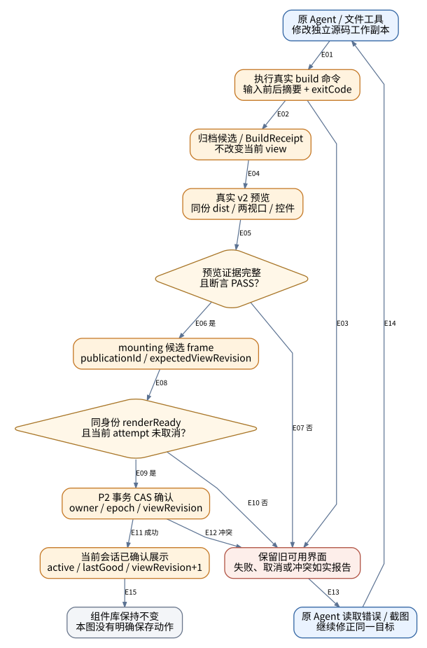
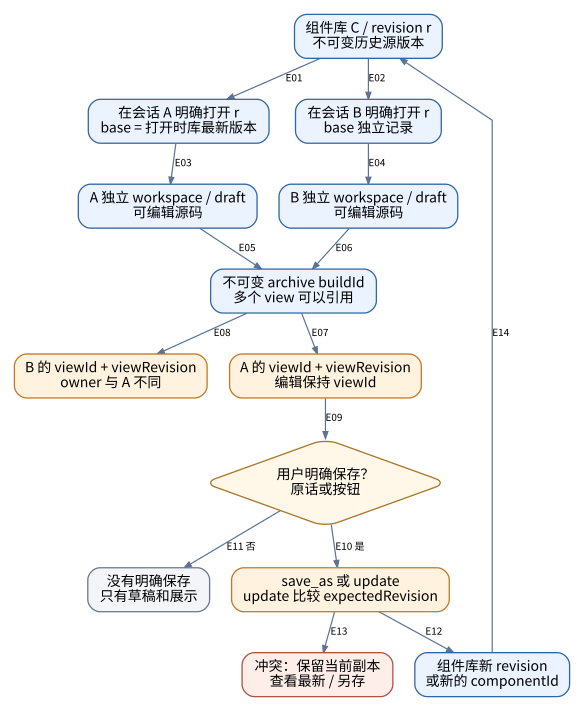
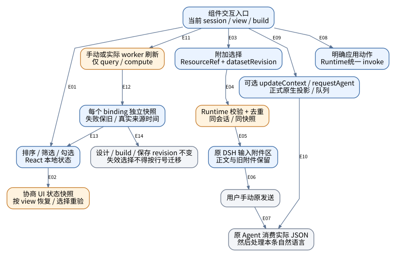
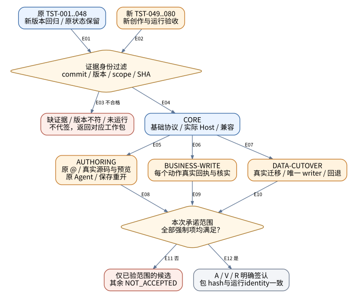

# DSH Apps · A.2 补充架构图与连线说明

**文件编号：DSH-APPS-ARCH-002　｜　修订：A.2　｜　日期：2026-10-07**

**状态：审计后续实施评审稿，未批准生产放行。** 新任务均为 TODO，新一轮产品验收均为 NOT_RUN。历史候选记录保留原标签，不由本次文件代签。

| 控制项 | 规定 |
|---|---|
| 审计快照 | `caea8175b5c7507bf942b2e752a7327063bfdd43`（main 读取时的固定提交） |
| 原始目标基线 | A.0 / `cb871b4086508988485dc4a0a5d6aa5440901267`；仓库 A.1 增加原聊天创作要求 |
| 已读版本 | bundle/Host candidate.6；Runtime candidate.4；DB 3；HTTP/目录 1；bridge 2.0。根 package.json 仍为 0.3.0，不代表整个运行系统版本。 |
| 文档体系 | AUDIT 说明证据与差距；TODO 规定工作包；SPEC 规定目标；ACCEPTANCE 规定验证；ARCH 规定图面关系 |
| 适用范围 | 本机优先；一个 Apps 入口、1+N 逻辑插件、原 DSH Agent/会话、一个 P2 Runtime；不重建 DSH 聊天或插件管理器 |
| 规范词 | 必须＝放行条件；不得＝禁止；应＝偏离须登记理由；可＝可选；“已实现”仅指本次见到的代码路径 |
| 角色 | A 架构责任人；I 实施人；V 验证人；R 发布责任人。姓名/日期/签认在执行时填写，不预先代填。 |

> **使用前检查：** SHA、实际进程/包版本和宿主契约与本文件不一致时，先生成差异表。不得将拟新增项目接口当作现有 DSH 服务。不得将文档检查、语法检查或原型演示计为生产验收。

## 00 图册规则

本图册从FIG-15续号，保留仓库A.1的FIG-13/14编号。A.0的FIG-01..12原件在references/A0/diagrams，可恢复供历史阅读；它们不是caea817的当前实现图。三张用户原图保留在references/inputs，不更改其字节。

所有图由同一节点/边模型生成DOT、SVG、PNG、Mermaid；每条箭头使用E编号，含义在其后关系表中。箭头编号仅在对应图内唯一。依赖/请求/状态/数据关系不混称网络调用。DOT/SVG为图面基准；Mermaid保留关系，自动布局可能不同。

蓝色＝本次已见代码路径，不等于验收；橙色＝本版拟补齐；灰色＝外部或已明确的事实边界；红色＝停止/恢复路径。颜色不是唯一语义，框内文字和下表仍能独立解释。

不把插件数量、安装包数量、源码包数量和进程数量混为一谈。P3是Client/frame执行上下文，不保证对应特定浏览器OS进程数；临时编译/预览子进程不等于新增常驻Runtime。
| 图号 | 内容 | 主要规格 |
|---|---|---|
| FIG-15 | 目标分层与本次改造位置（实现存在不等于验收） | 02 SPEC 第02章；REQ049/052 |
| FIG-16 | 创作证据、候选发布与失败恢复 | REQ054–063 |
| FIG-17 | 工作副本、视图和保存历史的关系 | REQ053/056/070–073 |
| FIG-18 | 组件交互四路分流与独立刷新 | REQ064–068/074–076 |
| FIG-19 | 整个架构按证据层次与范围放行 | REQ077–080 |

## FIG-15 · 目标分层与本次改造位置（实现存在不等于验收）

**读图结论：** 蓝色框表示已读到实现；橙色框表示本版拟补齐。它们是职责边界，不表示新增常驻进程。Hallmark/Notes具体Provider仅由P2组合根装配。图内不包含另一套Agent或聊天日志。

**证据/目标依据：** [S08](https://github.com/123wusongzhi/dsh-hallmark-app/blob/caea8175b5c7507bf942b2e752a7327063bfdd43/packages/app-runtime/src/index.ts) [S09](https://github.com/123wusongzhi/dsh-hallmark-app/blob/caea8175b5c7507bf942b2e752a7327063bfdd43/packages/service/src/apps-main.ts) [S10](https://github.com/123wusongzhi/dsh-hallmark-app/blob/caea8175b5c7507bf942b2e752a7327063bfdd43/bundles/apps/server/index.ts) [S16](https://github.com/123wusongzhi/dsh-hallmark-app/blob/caea8175b5c7507bf942b2e752a7327063bfdd43/packages/app-presentation/src/index.ts) [S20](https://github.com/123wusongzhi/dsh-hallmark-app/blob/caea8175b5c7507bf942b2e752a7327063bfdd43/packages/dsh-plugin/client/component-frame.tsx) [S22](https://github.com/123wusongzhi/dsh-hallmark-app/blob/caea8175b5c7507bf942b2e752a7327063bfdd43/packages/dsh-plugin/client/plugin.ts)

| 边 | 起点 → 终点 | 准确含义 |
|---|---|---|
| E01 | 用户 / 原 DSH 会话 → 原 DSH Agent / 原工具 / 原日志 | 原输入手动发送；原会话与Agent不替换 |
| E02 | 用户 / 原 DSH 会话 → 新增 @ 输入 source / 局部引用 UI | 选择应用；不是发送消息 |
| E03 | 新增 @ 输入 source / 局部引用 UI → P1 AppsHost / 四网关 / 原生代理 | 提交明确会话与连接绑定请求 |
| E04 | 原 DSH Agent / 原工具 / 原日志 → P1 AppsHost / 四网关 / 原生代理 | 使用现有四网关发现/调用应用能力 |
| E05 | P1 AppsHost / 四网关 / 原生代理 → P2 AppsRuntime / 唯一目录 / invoke | P1代理至P2；目录与业务执行在P2 |
| E06 | P2 AppsRuntime / 唯一目录 / invoke → Hallmark Provider / 原业务适配 | 已注册能力执行 |
| E07 | P2 AppsRuntime / 唯一目录 / invoke → Notes Provider / 真实 CRUD | 已注册异构Notes能力执行 |
| E08 | Hallmark Provider / 原业务适配 → P4 原 Hallmark / 业务事实与账本 | 原业务API及结果核实 |
| E09 | P2 AppsRuntime / 唯一目录 / invoke → 共享 Presentation / view / 保存 / 版本 | 已有共享展示与保存能力 |
| E10 | 共享 Presentation / view / 保存 / 版本 → SourceComponentStore / 不可变源码 + dist | 复用已有capture/checkout/verify |
| E11 | P2 AppsRuntime / 唯一目录 / invoke → 新增 Authoring 协议 / attempt / receipts / CAS | 拟新增项目能力；不另建模型循环 |
| E12 | 新增 Authoring 协议 / attempt / receipts / CAS → SourceComponentStore / 不可变源码 + dist | 候选存档与构建/预览证据关联 |
| E13 | 新增 Authoring 协议 / attempt / receipts / CAS → 共享 Presentation / view / 保存 / 版本 | 核对证据及CAS后发布目标view |
| E14 | 共享 Presentation / view / 保存 / 版本 → P3 原组件 frame / v2 bridge 已有 | 原生组件区按明确view读取 |
| E15 | P3 原组件 frame / v2 bridge 已有 → 新增候选就绪 / UI恢复 / 不替换原聊天 | 协商就绪及UI状态扩展 |
| E16 | 新增候选就绪 / UI恢复 / 不替换原聊天 → 新增 Authoring 协议 / attempt / receipts / CAS | 同候选身份的就绪回执；不是onLoad |
| E17 | 新增完整组件库 UI / 调用现有保存能力 → P1 AppsHost / 四网关 / 原生代理 | 接已有保存/历史/管理能力，不创建第二库 |

**图源：** `diagrams/FIG-15.dot` / `.mmd`；SVG/PNG与当前关系表同源。

## FIG-16 · 创作证据、候选发布与失败恢复

**读图结论：** 候选归档在预览前只为冻结字节，不是对用户发布，因此不违反“检查后展示”。本图CAS确认是取消与发布的线性化点；已确认后再报错，恢复旧构建必须新记操作，不能抹去已发布事实。

**证据/目标依据：** [S16](https://github.com/123wusongzhi/dsh-hallmark-app/blob/caea8175b5c7507bf942b2e752a7327063bfdd43/packages/app-presentation/src/index.ts) [S17](https://github.com/123wusongzhi/dsh-hallmark-app/blob/caea8175b5c7507bf942b2e752a7327063bfdd43/packages/source-components/src/index.ts) [S18](https://github.com/123wusongzhi/dsh-hallmark-app/blob/caea8175b5c7507bf942b2e752a7327063bfdd43/scripts/source-preview.mjs) [S20](https://github.com/123wusongzhi/dsh-hallmark-app/blob/caea8175b5c7507bf942b2e752a7327063bfdd43/packages/dsh-plugin/client/component-frame.tsx) [S05](https://github.com/123wusongzhi/dsh-hallmark-app/blob/caea8175b5c7507bf942b2e752a7327063bfdd43/docs/requirements/03_ARCHITECTURE.md)

| 边 | 起点 → 终点 | 准确含义 |
|---|---|---|
| E01 | 原 Agent / 文件工具 / 修改独立源码工作副本 → 执行真实 build 命令 / 输入前后摘要 + exitCode | 原DSH文件/命令工具，非关键词模拟 |
| E02 | 执行真实 build 命令 / 输入前后摘要 + exitCode → 归档候选 / BuildReceipt / 不改变当前 view | 仅exit0且输入不变；关联实际输出摘要 |
| E03 | 执行真实 build 命令 / 输入前后摘要 + exitCode → 保留旧可用界面 / 失败、取消或冲突如实报告 | build失败/旧dist/输入变化，不发布 |
| E04 | 归档候选 / BuildReceipt / 不改变当前 view → 真实 v2 预览 / 同份 dist / 两视口 / 控件 | 预览冻结archive中的真实dist字节 |
| E05 | 真实 v2 预览 / 同份 dist / 两视口 / 控件 → 预览证据完整 / 且断言 PASS？ | 收集截图、异常、请求、桥接和断言 |
| E06 | 预览证据完整 / 且断言 PASS？ → mounting 候选 frame / publicationId / expectedViewRevision | 是：准备候选；尚未称已展示 |
| E07 | 预览证据完整 / 且断言 PASS？ → 保留旧可用界面 / 失败、取消或冲突如实报告 | 否：保留证据，不更新active |
| E08 | mounting 候选 frame / publicationId / expectedViewRevision → 同身份 renderReady / 且当前 attempt 未取消？ | hello后还须验证首屏与约定数据 |
| E09 | 同身份 renderReady / 且当前 attempt 未取消？ → P2 事务 CAS 确认 / owner / epoch / viewRevision | 是：提交确认事务 |
| E10 | 同身份 renderReady / 且当前 attempt 未取消？ → 保留旧可用界面 / 失败、取消或冲突如实报告 | 否/超时/取消：候选无效 |
| E11 | P2 事务 CAS 确认 / owner / epoch / viewRevision → 当前会话已确认展示 / active / lastGood / viewRevision+1 | CAS成功才提升为当前确认build |
| E12 | P2 事务 CAS 确认 / owner / epoch / viewRevision → 保留旧可用界面 / 失败、取消或冲突如实报告 | 冲突或代际落后不得自动覆写 |
| E13 | 保留旧可用界面 / 失败、取消或冲突如实报告 → 原 Agent 读取错误 / 截图 / 继续修正同一目标 | 可定位错误及旧/候选build身份 |
| E14 | 原 Agent 读取错误 / 截图 / 继续修正同一目标 → 原 Agent / 文件工具 / 修改独立源码工作副本 | 原会话下一步或下一轮实际修改 |
| E15 | 当前会话已确认展示 / active / lastGood / viewRevision+1 → 组件库保持不变 / 本图没有明确保存动作 | 展示不写库；保存需要FIG-17显式条件 |

**图源：** `diagrams/FIG-16.dot` / `.mmd`；SVG/PNG与当前关系表同源。

## FIG-17 · 工作副本、视图和保存历史的关系

**读图结论：** 替代三张用户图中含糊的绿色保存/重开线。selectedSourceRevision可以是v1而baseRevisionAtOpen是v3；它们不应合并为“版本”。本图箭头表示数据/动作关系，不全是网络请求。

**证据/目标依据：** [S16](https://github.com/123wusongzhi/dsh-hallmark-app/blob/caea8175b5c7507bf942b2e752a7327063bfdd43/packages/app-presentation/src/index.ts) [S17](https://github.com/123wusongzhi/dsh-hallmark-app/blob/caea8175b5c7507bf942b2e752a7327063bfdd43/packages/source-components/src/index.ts) [U02](../references/inputs/image-044804.png) [U03](../references/inputs/image-044809.png) [U04](../references/inputs/image-044814.png)

| 边 | 起点 → 终点 | 准确含义 |
|---|---|---|
| E01 | 组件库 C / revision r / 不可变历史源版本 → 在会话 A 明确打开 r / base = 打开时库最新版本 | 选择源revision，不修改库 |
| E02 | 组件库 C / revision r / 不可变历史源版本 → 在会话 B 明确打开 r / base 独立记录 | 同一历史资产可被另一会话打开 |
| E03 | 在会话 A 明确打开 r / base = 打开时库最新版本 → A 独立 workspace / draft / 可编辑源码 | checkout到新的空目录 |
| E04 | 在会话 B 明确打开 r / base 独立记录 → B 独立 workspace / draft / 可编辑源码 | checkout到另一新空目录 |
| E05 | A 独立 workspace / draft / 可编辑源码 → 不可变 archive buildId / 多个 view 可以引用 | 实际构建后候选存档 |
| E06 | B 独立 workspace / draft / 可编辑源码 → 不可变 archive buildId / 多个 view 可以引用 | 实际构建后候选存档；相同字节可复用 |
| E07 | 不可变 archive buildId / 多个 view 可以引用 → A 的 viewId + viewRevision / 编辑保持 viewId | 仅通过FIG-16发布确认后引用 |
| E08 | 不可变 archive buildId / 多个 view 可以引用 → B 的 viewId + viewRevision / owner 与 A 不同 | 各自发布和CAS，不复制owner |
| E09 | A 的 viewId + viewRevision / 编辑保持 viewId → 用户明确保存？ / 原话或按钮 | 当前view是保存来源，不自动保存 |
| E10 | 用户明确保存？ / 原话或按钮 → save_as 或 update / update 比较 expectedRevision | 是：使用同一共享保存实现 |
| E11 | 用户明确保存？ / 原话或按钮 → 没有明确保存 / 只有草稿和展示 | 否/取消：组件库不变 |
| E12 | save_as 或 update / update 比较 expectedRevision → 组件库新 revision / 或新的 componentId | save_as新增ID；update CAS成功新增版本 |
| E13 | save_as 或 update / update 比较 expectedRevision → 冲突：保留当前副本 / 查看最新 / 另存 | CAS失败不改库、不丢副本 |
| E14 | 组件库新 revision / 或新的 componentId → 组件库 C / revision r / 不可变历史源版本 | 作为后续明确打开的资产版本 |

**图源：** `diagrams/FIG-17.dot` / `.mmd`；SVG/PNG与当前关系表同源。

## FIG-18 · 组件交互四路分流与独立刷新

**读图结论：** 刷新是否需要实时上游读由Provider解释；界面只报告真实fetchedAt/sourceDataTime/freshness。计划字段存在不等于worker已运行。新frame恢复与Agent上下文版本属于不同状态。

**证据/目标依据：** [S16](https://github.com/123wusongzhi/dsh-hallmark-app/blob/caea8175b5c7507bf942b2e752a7327063bfdd43/packages/app-presentation/src/index.ts) [S19](https://github.com/123wusongzhi/dsh-hallmark-app/blob/caea8175b5c7507bf942b2e752a7327063bfdd43/packages/component-runtime/src/apps-client.ts) [S23](https://github.com/123wusongzhi/dsh-hallmark-app/blob/caea8175b5c7507bf942b2e752a7327063bfdd43/packages/plugin-apps/client/component-handlers.ts) [S06](https://github.com/123wusongzhi/dsh-hallmark-app/blob/caea8175b5c7507bf942b2e752a7327063bfdd43/docs/apps-product-requirements-20261007.md)

| 边 | 起点 → 终点 | 准确含义 |
|---|---|---|
| E01 | 组件交互入口 / 当前 session / view / build → 排序 / 筛选 / 勾选 / React 本地状态 | 纯本地动作；新增模型步与业务写均0 |
| E02 | 排序 / 筛选 / 勾选 / React 本地状态 → 协商 UI 状态快照 / 按 view 恢复 / 选择重验 | 换frame前按声明的schema导出/恢复 |
| E03 | 组件交互入口 / 当前 session / view / build → 附加选择 / ResourceRef + datasetRevision | 只有点击附加才提交选择 |
| E04 | 附加选择 / ResourceRef + datasetRevision → Runtime 校验 + 去重 / 同会话 / 同快照 | 校验最新版本与资源归属 |
| E05 | Runtime 校验 + 去重 / 同会话 / 同快照 → 原 DSH 输入附件区 / 正文与旧附件保留 | 原生接纳只能称attached，不是sent |
| E06 | 原 DSH 输入附件区 / 正文与旧附件保留 → 用户手动原发送 | 发送仍由用户原输入动作决定 |
| E07 | 用户手动原发送 → 原 Agent 消费实际 JSON / 然后处理本条自然语言 | 正式会话输入与文件消费证据 |
| E08 | 组件交互入口 / 当前 session / view / build → 明确应用动作 / Runtime统一 invoke | 明确业务按钮走既有能力，不自行拼第二套实现 |
| E09 | 组件交互入口 / 当前 session / view / build → 可选 updateContext / requestAgent / 正式原生投影 / 队列 | 可选能力先探测；不影响默认手动链 |
| E10 | 可选 updateContext / requestAgent / 正式原生投影 / 队列 → 原 Agent 消费实际 JSON / 然后处理本条自然语言 | requestAgent有真实队列回执；context只留给后续消费 |
| E11 | 组件交互入口 / 当前 session / view / build → 手动或实际 worker 刷新 / 仅 query / compute | 原按钮/聊天或已装配调度触发读 |
| E12 | 手动或实际 worker 刷新 / 仅 query / compute → 每个 binding 独立快照 / 失败保旧 / 真实来源时间 | 各数据集成功或失败独立结算 |
| E13 | 每个 binding 独立快照 / 失败保旧 / 真实来源时间 → 排序 / 筛选 / 勾选 / React 本地状态 | 发送新数据事件，不触发编译 |
| E14 | 每个 binding 独立快照 / 失败保旧 / 真实来源时间 → 设计 / build / 保存 revision 不变 / 失效选择不得按行号迁移 | 刷新不能改设计/构建/组件库版本 |

**图源：** `diagrams/FIG-18.dot` / `.mmd`；SVG/PNG与当前关系表同源。

## FIG-19 · 整个架构按证据层次与范围放行

**读图结论：** 图中“签认”是目标节点，不是本次已获得批准。本次只有静态审计、HTML身份和语法检查；产品80项新运行均NOT_RUN。原型浏览器为BLOCKED_ENV，不证明产品失败。

**证据/目标依据：** [S03](https://github.com/123wusongzhi/dsh-hallmark-app/blob/caea8175b5c7507bf942b2e752a7327063bfdd43/docs/apps-publication-validation-20261007.md) [S04](https://github.com/123wusongzhi/dsh-hallmark-app/blob/caea8175b5c7507bf942b2e752a7327063bfdd43/docs/requirements/traceability.csv) [S26](https://github.com/123wusongzhi/dsh-hallmark-app/blob/caea8175b5c7507bf942b2e752a7327063bfdd43/docs/apps-migration-runbook.md)

| 边 | 起点 → 终点 | 准确含义 |
|---|---|---|
| E01 | 原 TST-001..048 / 新版本回归 / 原状态保留 → 证据身份过滤 / commit / 版本 / scope / SHA | 原PASS只能作为reported，不自动继承 |
| E02 | 新 TST-049..080 / 新创作与运行验收 → 证据身份过滤 / commit / 版本 / scope / SHA | 每个断言附原始证据，不只总数 |
| E03 | 证据身份过滤 / commit / 版本 / scope / SHA → 缺证据 / 版本不符 / 未运行 / 不代签，返回对应工作包 | 不合格：先补实际执行或证据 |
| E04 | 证据身份过滤 / commit / 版本 / scope / SHA → CORE / 基础协议 / 实际 Host / 兼容 | 符合当前版本的基础范围证据 |
| E05 | CORE / 基础协议 / 实际 Host / 兼容 → AUTHORING / 原 @ / 真实源码与预览 / 原 Agent / 保存重开 | 再满足默认手动创作和真实模型链 |
| E06 | CORE / 基础协议 / 实际 Host / 兼容 → BUSINESS-WRITE / 每个动作真实回执与核实 | 再满足用户指定真实写动作 |
| E07 | CORE / 基础协议 / 实际 Host / 兼容 → DATA-CUTOVER / 真实迁移 / 唯一 writer / 回退 | 再满足实际接入库/资产切换 |
| E08 | AUTHORING / 原 @ / 真实源码与预览 / 原 Agent / 保存重开 → 本次承诺范围 / 全部强制项均满足？ | 作者体验范围签认 |
| E09 | BUSINESS-WRITE / 每个动作真实回执与核实 → 本次承诺范围 / 全部强制项均满足？ | 各业务动作分别签认 |
| E10 | DATA-CUTOVER / 真实迁移 / 唯一 writer / 回退 → 本次承诺范围 / 全部强制项均满足？ | 切库范围签认 |
| E11 | 本次承诺范围 / 全部强制项均满足？ → 仅已验范围的候选 / 其余 NOT_ACCEPTED | 否：只陈述已通过范围和限制 |
| E12 | 本次承诺范围 / 全部强制项均满足？ → A / V / R 明确签认 / 包 hash与运行identity一致 | 是：签本次承诺的整体范围 |

**图源：** `diagrams/FIG-19.dot` / `.mmd`；SVG/PNG与当前关系表同源。

## 06 图面签认与变更

图面变更先修改节点/边模型，再同步DOT、SVG、PNG、Mermaid与关系表；不能只在PNG上画一条未说明的线。CR需写被修改的图号/边号、前后语义、关联REQ/TST和审查人。

本版图面已做文件生成与排版检查，但节点上的运行功能仍以代码和产品测试证明。FIG-19的“批准”节点只是目标。图中任何用户示例名称、颜色、图标均不构成真实业务或原生宿主运行证据。
